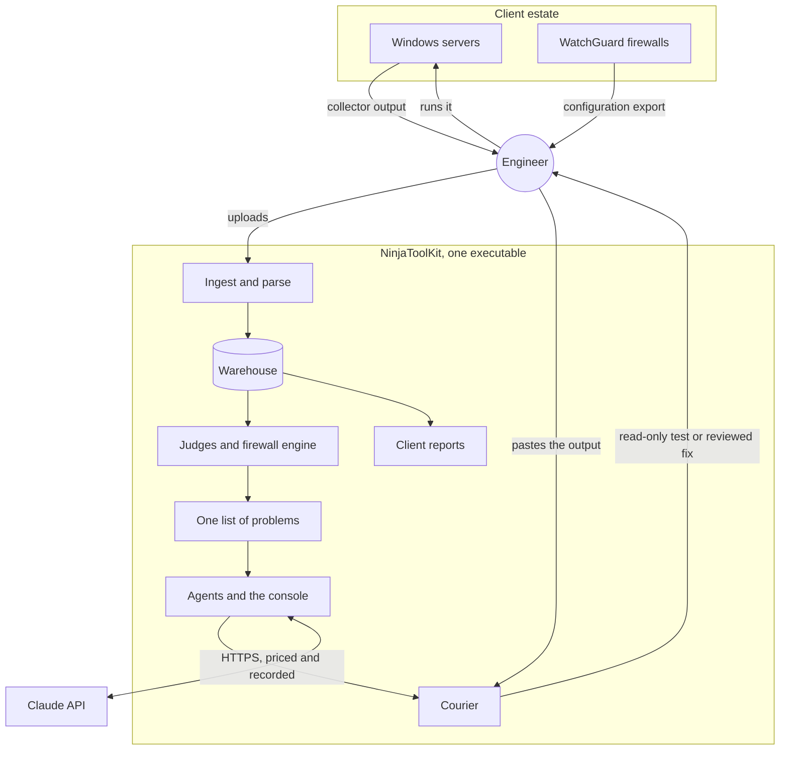
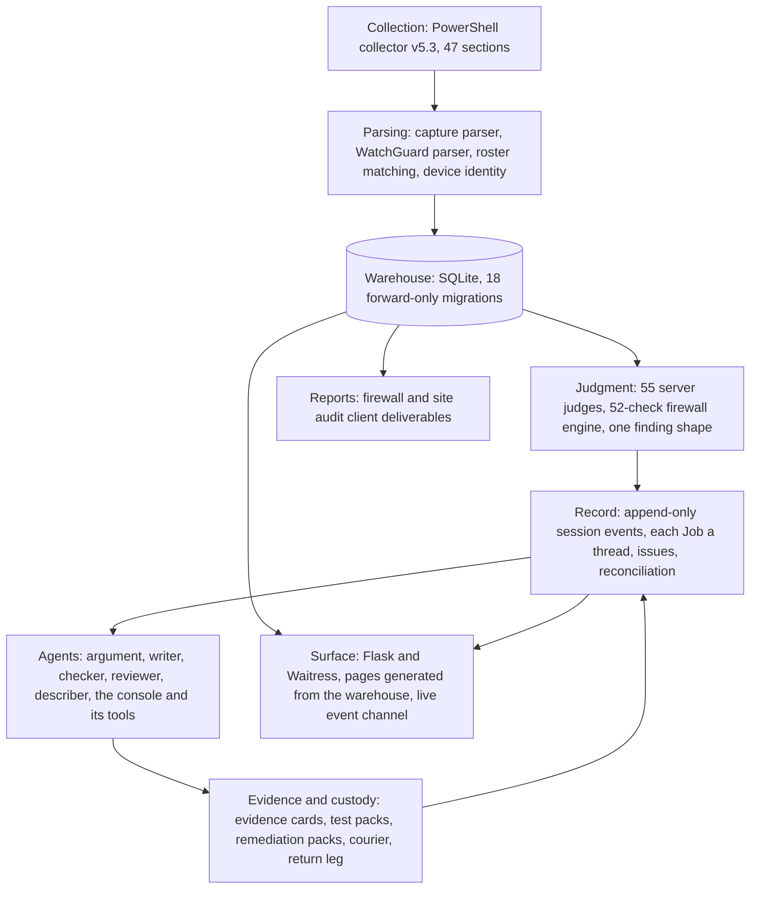
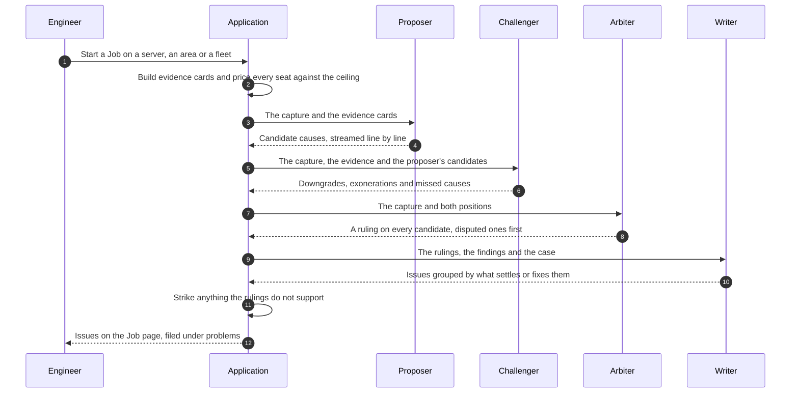
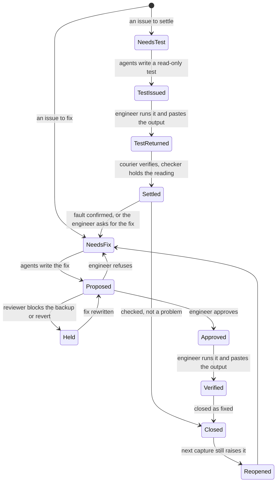
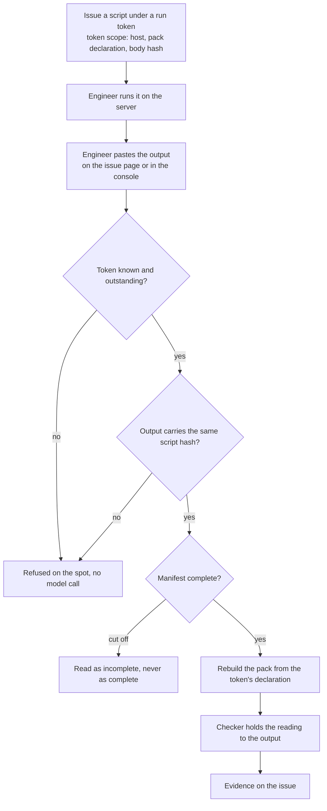
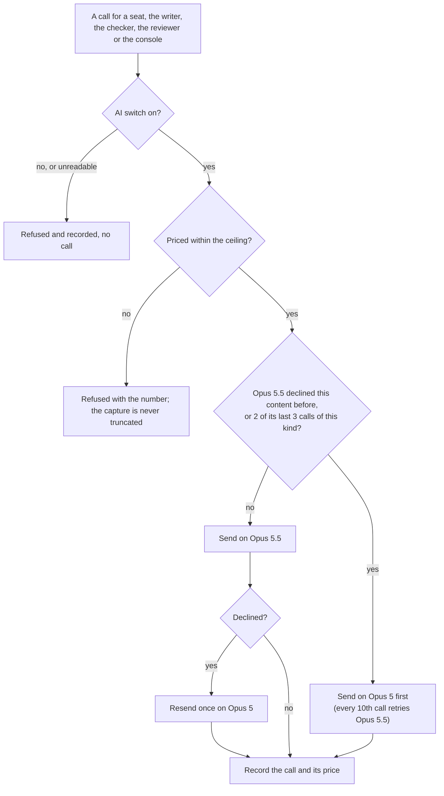
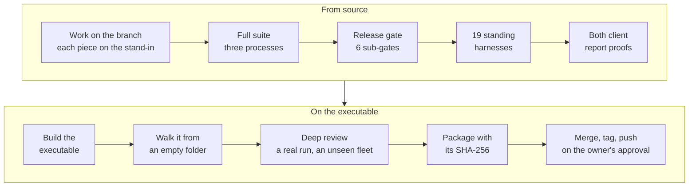

# NinjaToolKit: An Agentic Audit and Remediation Platform for Managed Infrastructure

**A technical case study**

**Author:** Ryan Haig, Forward Deployed Engineer, eMazzanti Technologies
**Subject:** NinjaToolKit v8.2.0, released September 30, 2026
**Status:** In production use by the engineering team of a managed service provider
**Measurement:** Every figure in this document was measured against the v8.2.0 release on September 30, 2026, unless it
is labelled with an earlier release or as historical. The platform is private company software; this document
describes its design and behavior without reproducing its source or any client data.

---

## Contents

1. [Summary](#1-summary)
2. [The problem and its constraints](#2-the-problem-and-its-constraints)
3. [System architecture](#3-system-architecture)
4. [Data engineering: from a PowerShell capture to one list of problems](#4-data-engineering-from-a-powershell-capture-to-one-list-of-problems)
5. [Network engineering: the firewall audit engine](#5-network-engineering-the-firewall-audit-engine)
6. [Server architecture: what the judges read](#6-server-architecture-what-the-judges-read)
7. [Agentic orchestration: the adversarial diagnosis and the console](#7-agentic-orchestration-the-adversarial-diagnosis-and-the-console)
8. [From diagnosis to verified fix: the issue lifecycle](#8-from-diagnosis-to-verified-fix-the-issue-lifecycle)
9. [Cybersecurity: the safety model](#9-cybersecurity-the-safety-model)
10. [Model governance: routing, refusals and cost](#10-model-governance-routing-refusals-and-cost)
11. [The engineer's surface](#11-the-engineers-surface)
12. [DevOps and release engineering](#12-devops-and-release-engineering)
13. [Verification: measurement over assertion](#13-verification-measurement-over-assertion)
14. [Results](#14-results)
15. [How I build](#15-how-i-build)
16. [Lessons](#16-lessons)
17. [What comes next](#17-what-comes-next)
18. [Appendix: glossary](#18-appendix-glossary)

---

## 1. Summary

NinjaToolKit turns the raw configuration of a managed estate into engineering work that closes. At release, its first
diagnosis of a nine-server client fleet it had never seen took 12 minutes and $4.56 in model calls, and produced 41
issues. Carrying the work on through the console, from a conversation to an approved fix and a closed issue, brought
the run to 24 calls and $16.07 in all. No module in the platform can execute anything on a client machine: the
engineer runs every script and approves every change.

The platform ingests the output of a 47-section PowerShell collector and WatchGuard firewall exports, judges them
with deterministic code, and organizes every finding into one list of problems. On any server, area or client fleet
it then runs a gated, adversarial multi-agent diagnosis. The diagnosis ends in issues, not a report, and each issue
walks to a verified close: a read-only test the engineer runs and pastes back, a fix that a second agent reviews and
the engineer approves, and a close that the next capture confirms or reopens. In v8.2 the Job is the thread. The
agents' run, the engineer's conversation with the console, every script, every returned output and every decision
form one record, and the Job page and the console are two views of it.

Three design decisions define the system:

- **The model proposes; code decides; the engineer approves.** Every agent output is parsed into a fixed shape and
  held to evidence by code before it reaches a page. The platform has no transport to a client machine.
- **Disagreement is structural.** A single model asked to check its own diagnosis agrees with itself. The platform
  gives a second agent a different task with a different success condition (break the diagnosis) and a third agent
  the job of ruling between them.
- **Everything ships as one file.** The platform is a single self-contained Windows executable with no runtime
  dependency beyond the model API, so an engineer can run it on an office server from an empty folder.

| At v8.2.0 | |
|---|---|
| Product code | 203,334 lines of Python, plus a 4,021-line PowerShell collector |
| Tests | 13,267 passed in the release run (3 failed there and passed on re-run), in 156,832 lines of test code |
| Standing verification | 19 harnesses, a 6-part release gate and 72 rendered-product invariants, run before every release |
| Server judgment | 55 deterministic judges across nine areas of a server |
| Firewall audit | 52 checks, mapped to 50 controls across four compliance frameworks |
| Agents | Proposer, challenger, arbiter and writer; a checker, a reviewer and a describer; a console that converses on the Job, with four tools |
| History | 4,689 commits and 57 tagged releases between March and September 2026 |
| A real run at release | A nine-server fleet never diagnosed before: 12 minutes, $4.56, 41 issues; 24 calls and $16.07 through a closed fix |

v8.2 rebuilt the product's joins rather than adding features. My walk of its first release candidate failed it while
the test suite passed: a firewall had no single identity, so 37 devices were shown as 25, and the console's
conversation belonged to the server rather than to the work. The release rebuilt each join as a planned item, with a
prediction written before the edit and a walk after it. Product code fell by 808 lines over the release, even though
it gained a conversational console, device identity and a tool loop. A final review on a fleet the platform had never
seen then found a safety defect in the fix script's header, and the release corrects it by failing closed
(Section 8.5).

---

## 2. The problem and its constraints

### 2.1 The operating reality

A managed service provider audits estates it does not own, for clients who expect evidence, at a cadence set by
the threat picture rather than by the calendar. Before this platform, a major audit meant senior engineers
stitching together the partial views of several vendor tools, each of which saw one slice of the estate. By the
team's own estimate that took 60 to 80 hours per engagement, and nothing carried forward: every audit was a one-off.

The deeper problem was not the audit. It was what came after it. A report lists what is wrong. It does not diagnose
why, produce the test that would settle a doubt, or track whether a fix held. That work happened in engineers' heads
and in ticket threads, so it was not recorded, not reproducible and not reviewable.

### 2.2 What the platform had to be

The constraints were set by the environment, and each one shaped the architecture:

| Constraint | Why it exists | What it forced |
|---|---|---|
| One self-contained executable | It runs on an office server used by the whole team, often with no development tooling installed | No runtime dependencies beyond the model API; every asset bundled; a build check that nothing outside the bundle is opened |
| The engineer is the gate | The platform acts on client infrastructure under contract | No transport to client machines at all; every script run by a person; every change approved by a person |
| Evidence first | Client deliverables must survive scrutiny | Reports render the named entities behind every count; findings carry the lines that prove them |
| Nothing seeded | A demo estate in production code is a liability | The application starts empty and shows only what was ingested |
| Bounded, visible cost | Model calls are paid per token, and a runaway argument is real money | Every call priced before it is sent; a ceiling per argument and per console turn; every call recorded |
| Frontier models only | A hallucinated finding in a client deliverable costs more than an expensive call | No small-model tier; a cheaper model may describe but never diagnose |

---

## 3. System architecture

### 3.1 Context



The platform sits between the engineer and the estate, never between the estate and anything else. Data reaches
it only through the engineer (a collector run, a configuration export), and work leaves it only through the
engineer (a script to run). The one external network dependency is the model API, and it is used only when the
engineer has switched the AI on.

### 3.2 Layers



| Layer | Representative modules | Size at v8.2.0 |
|---|---|---|
| Collection | the PowerShell collector | 4,021 lines |
| Parsing | capture parser, firewall engine and parser, client registry | 6,793, 12,967 and 4,245 lines |
| Judgment | server judges, one finding shape | 55 judges |
| Record | console session, event log, Jobs, run record, reconciliation | 13 event kinds |
| Agents | argument, issue write-up, reading check, fix review, describe, console runner | 7 agent roles and the console |
| Evidence and custody | evidence cards, target packs, script analysis, remediation packs, courier, return leg | 3 script states, 4 fix parts |
| Surface | the Flask application, the page server, 97 console modules | 66,666 lines in `ui/` |
| Reports | the firewall and site audit renderers | 48,283 lines |
| Model access | one API client, model registry, call ledger, master switch | 24 modules in the AI package |

### 3.3 Runtime model

The executable starts a Flask application under the Waitress WSGI server, creates a `data` folder beside itself
for the SQLite warehouse and logs, and serves the console on a local port. Pages are generated on the server from
the warehouse and carry their own scripts and styles; there is no front-end build step and no framework.

A page build is reused until the warehouse changes. The cache is keyed on the database file itself, never on a clock,
because a clock-based cache serves stale data for its whole window and cannot say that it did. One thread builds a
page while the others wait for it. Before that lock existed, server threads that missed the same page each parsed the
same firewall configurations, six parses per firewall, and a cold start grew to 137 seconds as the warehouse filled
(historical, measured from the log).

Long-running work (an argument between agents takes minutes) runs on a background thread per session. The page
follows it through a server-sent event stream keyed by the session's event sequence number, so a dropped
connection resumes exactly where it stopped, and one shared poller tells every open page which runs are live.

### 3.4 The record is the source of truth, and the Job is its thread

Everything the platform does is an event in an append-only log, one session per object (a server, a client, a
problem). A Job is not a table. It is a thread inside that log. Every event carries the Job it belongs to, and the Job
is read back from its own events: the engineer's request, the agents' turns and claims, the case they built, the
console's conversation, the captures it read, the scripts it issued, what came back, the issues written and the
decisions that closed them. The Job page and the console are two views of that one record.

Two properties follow:

- **A restart cannot corrupt a Job.** Every projection is rebuilt from the log. A run that a dead process left open
  is found at boot, marked stopped, and offered for resumption.
- **Two Jobs on one server never share a conversation.** The history the model receives for a console turn is built
  from that Job's events alone. Before v8.2 it was built from the server's whole session, so a question asked in one
  Job carried every other Job's turns with it.

A Job can be archived or deleted, and both are events. An archived Job leaves the working lists and is listed
apart. A deleted Job leaves every list, every search and the console, but the log is append-only and keeps its
events. The confirmation says so, rather than promising an erasure the design does not perform.

The log has one rule that runs through the whole platform: **absence is not zero.** A script with no returned
output is "not returned", never "returned empty". A capture that could not read a section says so, and that is
kept apart from "measured and found nothing". A missing setting for the AI switch reads as off.

---

## 4. Data engineering: from a PowerShell capture to one list of problems

### 4.1 The collector

The collector is a 4,021-line PowerShell script (version 5.3), plain ASCII so that it parses under Windows PowerShell
5.1. It is pasted into the remote-management tool the team already uses and pushed across the fleet. It captures 47
sections of configuration and state:

- hardware and firmware, the operating system and its servicing stack, and patches;
- services and their accounts, listening ports and scheduled tasks;
- local and domain accounts, group membership, and shares with their NTFS permissions;
- all four certificate stores, the host firewall, DNS, time and event logs;
- backup and volume shadow copy state, disk health, and BitLocker and TPM;
- Kerberos delegation, LAPS and LSA protection;
- SMB, TLS, RDP and WinRM posture, installed software, and more.

It is designed around one rule: **it captures what an engineer needs to reason about credential exposure, and never
the credentials themselves.** It reads password-set timestamps, service principal names, encryption types and
NTLM compatibility levels. It does not read passwords, hashes, LSA secrets or DPAPI keys.

### 4.2 Ingestion

Three inputs go in, in a fixed order, through the Ingest page. Each box there takes a file that is picked or dropped
onto it:

1. **The device roster** (an export from the remote-management portal). It defines which clients and servers
   exist, and nothing else can be saved until it is in.
2. **The collector's capture.** One text file of up to 200 MB may hold hundreds of servers. The parser splits it by
   host, strips the remote-management tool's wrapper text, matches each host to the roster, and stores the parsed
   sections.
3. **The firewall exports.** Each WatchGuard XML export is parsed, audited by the full engine, and stored with its
   canonical audit in one transaction, against the device it came from (Section 4.5).

The parser tolerates missing sections, partial sections and version drift between collector versions without
dropping data, and it records what it could not read rather than defaulting it. Host names arrive uppercase in one
source and lowercase in another. Every join between them is case-insensitive, in the browser as well as on the
server, and so is every domain name: a directory written in two cases is one directory.

### 4.3 One finding shape

The two pillars produce findings in different ways. The server judges are functions over a parsed capture; the
firewall engine is a set of checks over a normalized configuration model. An adapter maps both into one finding
shape (what was found, why it is true on this machine, the evidence lines, what would make it wrong, the fix), and
every consumer reads that shape. The judges and the engine were never rewritten to fit each other; the shape sits
between them.

On top of that shape sits **one list of problems**. The judges find what they were written to find. The agents,
reading a server's whole capture, find the rest. Both land in the same list, one page per problem, worst first. An
issue has exactly one home (a server and an area). An issue that an older open Job already holds is shown there as
"already open" rather than filed twice. A problem found at two or more clients becomes a Global: a single brief for
the team's project list rather than a separate ticket per client.

### 4.4 Stable identity for findings

A finding that is renumbered between two audits cannot be tracked, compared or reopened. Findings therefore carry a
content-derived identity from a registry of 91 signature recipes, one per finding type. Each recipe declares which
target fields and anchor fields identify its finding, and the identity is the SHA-256 of the recipe and those
normalized values. The same finding on the same target produces the same identity on every run. A different
certificate, policy, listener or server produces a different one. Recipe identifiers are permanent, because renaming
one would orphan every record that refers to it.

### 4.5 Device identity: a firewall is its configuration, not its file or its client

Stable identity applies to devices as well as findings, and v8.2 is where that was learned. Through v8.1, a
firewall's audits were grouped by client and model. A firewall uploaded without a client therefore had an empty key
and merged with every other firewall of its model. On the production corpus, 37 firewalls were shown as 25, and four
of eleven audit-to-audit comparisons compared two different devices. Each count on those pages was internally
consistent and wrong.

A firewall is now identified by its configuration's own system name and model, never by its file name:

- the same export uploaded under another file name is a new capture of the same device;
- a file name already held by a different system is stored as a second device rather than over the first;
- each audit records the device it belongs to, so a comparison is only ever between a firewall and its own earlier
  audits.

The engineer can give a firewall a name, and the pages and its report carry that name. The client link is suggested
from the roster and stored only when the engineer confirms it. A guessed link, silently stored, would be the same
defect in a different field.

Measured from an empty folder, with the 54 exports on this machine loaded through the page's own controls: 37
firewalls and 37 audited devices. The change reached the warehouse as one additive migration that backfills from
what is stored and deletes nothing.

### 4.6 Four invariants

Four rules hold across every layer, and each exists because breaking it once produced a wrong client deliverable:

1. **Evidence first.** A report renders the named entities behind every count. "Eight expired certificates" without
   the certificate subjects is incomplete, however well it is laid out.
2. **Comprehensiveness.** A firewall audit is the whole firewall. There is no "top ten"; navigation layers over the
   complete content and never replaces it.
3. **Granularity preserved.** Every field the collector captures survives capture, parsing, the page and the report
   without collapsing into a count.
4. **Commercial boundary.** Client-facing reports carry no pricing, cost or margin content. A test walks the
   rendered report and fails on any currency amount outside an engineer-only container.

---

## 5. Network engineering: the firewall audit engine

### 5.1 Model and parser

The firewall pillar reads WatchGuard Fireware configuration exports. The parser builds a normalized model of the
device:

- policies in their true processing order, with aliases resolved to their members;
- service objects, NAT translations, and interfaces and zones;
- IKE and IPsec policies and VPN tunnels;
- accounts, authentication servers, subscription services and management settings.

XML is parsed with a hardened parser. Each upload gets its own engine instance, so two engineers auditing at once can
never overwrite each other's device.

### 5.2 The 52 checks

| Area | Checks |
|---|---|
| Rule base | overly permissive rules, shadowed rules, duplicate rules, unused and disabled rules, unattached and sparsely used objects, policy logging, configuration hygiene |
| Exposure | internet-facing services, dangerous ports, NAT exposure, deep NAT follow-through, remote access portal, geo-blocking posture |
| Cryptography and VPN | VPN security, VPN algorithms, tunnel scope, L2TP, SSL VPN, mobile VPN identity, TLS profiles |
| Management plane | management access, SNMP, logon banner, authentication posture, directory transport, credential exposure, plaintext integration credentials |
| Inspection and threat services | HTTPS inspection, proxy coverage, IPS, antivirus, advanced threat services, WebBlocker, application control, HTTP/3 and QUIC posture, DNS egress posture, DoS prevention, anti-spoofing |
| Resilience and routing | HA failover state, dynamic routing posture, IPv6 posture, wireless posture, missing security features |
| Vulnerability intelligence | firmware correlation against the known-exploited vulnerabilities catalog |
| Traffic-log analysis | traffic anomalies, denied patterns, policy hit correlation, geo-IP risks, command-and-control beaconing, lateral movement, blind spots |

Eight checks read traffic or device logs: the traffic-log group, plus the unused and disabled rules check, which
needs hit counts. When the logs are not supplied, the audit states which checks did not run and why, rather than
presenting a narrower audit as a complete one. The engineer adds the logs on the firewall's own page and runs the
audit again there.

### 5.3 The analysis that matters

Three pieces of network analysis do most of the work that a rule-by-rule reading cannot:

- **Precedence simulation.** Policies are evaluated in the order the device evaluates them, with aliases resolved,
  so a rule that can never match because an earlier rule already takes its traffic is found as a shadowed rule.
  The detector compares the address space the aliases resolve to. An earlier version compared alias names, which
  are unique per policy, so it could never match and never fired.
- **NAT follow-through.** An exposure is not the policy port. A static NAT can publish an internal RDP host on a
  non-standard external port, and a policy-level check that looks for port 3389 will see nothing. The engine follows
  the translation to the real internal host and service, and names both.
- **Attack-chain correlation.** Findings that are individually moderate can compose into a path: an exposed
  service, a weak authentication posture behind it, and no inspection in between. The engine correlates findings
  into chains and tags them with MITRE ATT&CK techniques.

### 5.4 Compliance mapping

Every finding maps to the controls it affects across four frameworks. Every control's status (pass, fail, or not
applicable because the data is not present) is derived from the findings rather than asserted:

| Framework | Controls |
|---|---|
| PCI DSS v4.0 | 11 |
| CIS Controls v8 | 12 |
| NIST CSF 2.0 | 14 |
| CMMC 2.0 | 13 |

A positive finding (a service confirmed enabled and active) affirms its control rather than failing it. That
distinction was a defect once, and it is now a rule of the mapping.

### 5.5 At scale

Run over the 54 WatchGuard exports on this machine, which resolve to 37 firewalls, the engine raised 2,173 findings:
146 critical, 382 high, 552 medium, 609 low and 484 informational. Every one carries the configuration evidence that
raised it and the policy it concerns, cited by the number the device's own management interface shows.

Between releases the severity split moved, and the reason for the move matters more than the total. On the same 36
exports, v8.1.0 raised 184 critical findings and v8.2.0 raises 107; the total is 1,415 on both. The 77 findings
that moved were static NAT translations that no enabled policy carries: configured, but publishing nothing. They
are now low-severity clean-up items, while NAT follow-through still names the internal host behind every translation
that a policy does carry. A critical finding that an engineer learns to discount teaches them to discount the other
107.

The engine's output feeds an 18-chapter client report and the firewall's page in the console, where the engineer
names the device, confirms its client, adds its logs, runs the audit and reopens the stored report.

---

## 6. Server architecture: what the judges read

### 6.1 The judges

The server pillar's 55 judges are deterministic functions over a parsed capture. Each one raises a finding only when
the capture establishes it, names what would make it wrong, and files it into one of nine areas of a server:
endpoint agents, network path, session host, identity and name, OS and resource, hardware, third-party software,
policy, and outside the host.

| Area of concern | Representative judges |
|---|---|
| Identity and Active Directory | Domain Admins sprawl, unconstrained delegation, Kerberoastable service accounts, LDAP signing not required, legacy domain functional level, stale user and computer accounts, WDigest credential caching, services running as domain users or local administrators |
| Exposure and protocols | legacy SMB, legacy TLS, RDP without Network Level Authentication, WinRM Basic authentication, WinRM trusted-hosts wildcard, exposed database or cleartext services, host firewall off or open, custom rules opening risky ports, legacy name resolution, public DNS resolvers on domain members, unsafe dynamic DNS updates |
| Endpoint protection | no real-time protection, two endpoint products active at once, stale signatures, third-party remote access installed, Print Spooler on a domain controller |
| Resilience and recovery | no backup agent, unhealthy VSS writers, disk errors in the system log, volumes critically low, memory pressure, virtual machines in a critical state |
| Lifecycle and servicing | end-of-life operating systems and SQL Server instances, end-of-life software, stuck servicing stack, automatic updates disabled, unsupported firmware age, certificates expiring without replacement |
| Configuration hygiene | volume encryption absent, Secure Boot disabled, unrestricted PowerShell execution policy, legacy PowerShell engine, Telnet client present, broad share permissions, shares owned by deleted accounts, roles installed and never used |

Eighteen judges also declare a named doubt: a condition the capture cannot settle on its own, such as whether a
legacy protocol is still in use by something on the network. Those doubts are what the agents' tests are built to
settle (Section 8). Thirty-nine judges carry a remediation, so a finding the engineer wants fixed without a
diagnosis can go straight to a Change Job whose issues come from code rather than a model.

### 6.2 A judge that fires everywhere has stopped being a finding

For v8.2 every judge was measured against the 200 servers of the production estate, with every stored capture
re-read by the current parser. Six judges were raising findings on servers where the capture did not establish
them. The counts are servers raised, before the change and after:

| Judge | Before | After | What made the difference |
|---|---|---|---|
| Unrestricted PowerShell execution policy | 198 | 6 | The machine's own policy, not the process scope the collector sets for itself in order to run |
| LDAP signing not required | 196 | 52 | Domain controllers only, the servers the setting governs |
| Unconstrained delegation | 74 | 7 | Raised once per domain, naming only principals that are not domain controllers |
| Stuck servicing stack | 63 | 2 | Pending file renames alone are not a servicing failure; a servicing flag must predate the last boot |
| Disk errors in the system log | 61 | 8 | The collector's own failed query is not a disk error; the eight are the servers whose capture reports disk errors |
| Unhealthy VSS writers | 14 | 4 | A failed query is recorded as not measured, not as a failure |

Each removed finding was a false positive on one server. Together they were a larger problem than any of them: a
finding raised on 198 of 200 servers teaches an engineer to skip it, and the habit carries over to the six servers
where it is true.

---

## 7. Agentic orchestration: the adversarial diagnosis and the console

### 7.1 Why one agent is not enough

A model asked "what is wrong with this server" commits to an answer and then defends it. Asked to check its own
proposal, it agrees with itself. In a real investigation the most expensive fault is the one everybody agreed on,
because an over-determined problem (several independent faults that can each produce the symptom) hides behind the
first plausible cause.

The platform's answer is to separate the roles and give each a different success condition. Retractions that took
an engineer a day by hand now happen inside the same run.

### 7.2 The protocol



- **The proposer** enumerates candidate causes exhaustively, across all nine areas. A cause it thinks unlikely still
  goes on the tree at a low status, because the value of the tree is that the whole solution space is visible.
- **The challenger** is told that its task is not to agree. It receives the proposer's candidates and attacks each one
  it can, with evidence: usually a downgrade, and "exonerated" when the capture actually rules the cause out. It is
  told not to downgrade what it cannot attack, and to add the causes the proposer missed.
- **The arbiter** receives the capture and both positions and rules on every candidate either seat raised, naming the
  evidence that decided each dispute. It may rule that two candidates are the same fault on different machines, or
  that one is a consequence of another. It is told not to split the difference.
- **The writer** turns the rulings into issues: what was found, what it does, and what to do. It groups them by what
  settles or fixes them (the same test settles them, or the same change closes them), in the order an engineer works
  them: tests first, then fixes, then questions for the client, then projects.

### 7.3 The claim as a contract

Every agent writes candidates in one fixed line format:

```
CANDIDATE: <id> | <area A-I> | <symptom> | <status> | <hypothesis> | <evidence> | <hosts>
```

and every status has one meaning:

| Status | Meaning |
|---|---|
| confirmed | The capture establishes that the fault is present. |
| strong | It leads, and something still has to prove it. |
| plausible | It fits, and nobody has tested it. The honest state of most of a real investigation. |
| weak | Noted, minor, and would not change what anyone does. |
| exonerated | Tested and ruled out by evidence in this capture, which must be named. |

A candidate is always written as the fault, never as its negation, so "confirmed" always means the fault is present.
That rule came from measurement. When agents were allowed to write "memory is not a contributor", a later seat
promoted it to "confirmed", and the page listed a healthy subsystem among the confirmed faults.

The format is deliberately six fields, plus a seventh naming the hosts when a claim holds on specific machines. Every
extra field is one more thing a line can get wrong, and a malformed line is a lost hypothesis. Code parses the lines;
the model never decides what the page shows.

Real output tests the contract. On the nine-server run at release, 11 of the proposer's 50 claims and one of the
arbiter's arrived with a field slipped: the hypothesis written before the status, or the symptom left out. The
parser dropped all twelve as designed, so the run lost more than a fifth of the proposer's work. The repair keeps
the contract's rule and uses its structure. A status is one of five words, so where the status sits says which
field is which, and both slips are now read as written. A line with no status at all is still dropped, because a
status is never supplied on the model's behalf.

### 7.4 Designed for truncation

The arbiter's work grows with the number of candidates, and a real server can produce dozens. Its output can be cut
off at a length limit. The protocol makes that failure graceful rather than silent:

- The tree is folded by **last assertion wins**, so a candidate the arbiter never reaches keeps the status the
  earlier seats gave it. That is a true statement about the investigation, not a gap.
- The arbiter is told to rule on **disputed candidates first**, so a cut loses only the candidates nobody was
  arguing about.
- Every seat is told to **lead with its lines** and put commentary after them, so a truncation never destroys a
  seat's entire contribution.
- A seat that stops at its length limit **says on the page that its list may be incomplete**, rather than presenting
  a cut list as a complete one. On the nine-server run the challenger stopped at its 32,000-token limit and said so.

### 7.5 Context engineering

Each seat reasons over **evidence cards** built by code, and every claim must cite a card:

| Card | Contents |
|---|---|
| F | The server's judged findings: what, why, the evidence, and what would make it wrong |
| P | How the server differs from its peers (same client, same role): services, software, endpoint products, DNS servers, pending reboot, uptime |
| E | The last critical and error events the capture kept, and event sources compared with the peer median |
| M | What the capture could not say, kept apart from what it measured and found clean |
| N | The client's standing notes: what must not be touched, and why |

A seat that needs more context can ask for it in the same fixed format (`NEED: <host> | <reason>`), and the platform
supplies a neighbor's capture within the cost ceiling. The capture itself is never summarized or truncated to fit a
budget. A digest hands the model the statistic and throws away the evidence, so a seat that cannot be afforded in
full is refused instead.

### 7.6 Holding the output to the evidence

Three agents exist only to hold other agents to evidence, and code makes the final decision in each case:

- **The writer is held to the rulings.** An issue that names a machine, a number, a path or a quoted name that is not
  in the rulings, the findings or the case is dropped and reported, never kept. Ruling identifiers and finding keys it
  does not recognize are struck.
- **The checker holds a reading to its output.** When the engineer pastes a test's output, a principal agent rules
  causes confirmed or ruled out. The checker sees only the raw output and those rulings, and must quote, for each
  ruling, the line of the output that shows it. Code then keeps a ruling only if its quoted line is really in the
  output. What the output shows that no ruling addresses comes back as new, untested candidates.
- **The reviewer checks a fix before it is offered.** It reads the server's capture, the case and the change in its
  four parts, and objects only on the machine's own evidence:
  - a backup that saves nothing the revert can use;
  - a revert that does not restore;
  - a verification that cannot see the fault;
  - dependencies of what the change touches;
  - whether it runs under Windows PowerShell 5.1 as SYSTEM.

  A blocking objection to the backup or the revert holds the fix; a change that cannot be undone is not offered on a
  promise.

A fourth, the **describer**, runs on a cheaper model and does only one thing. It names the problem a ruling states, so
the same problem on another server files with it. It rules on nothing and adds nothing to an issue's evidence.

### 7.7 Live orchestration

Claims are drawn as the agents write them. The model's streamed text is read line by line as it arrives. Each
completed candidate line is parsed and handed to the page, where it appears as a provisional mark on its seat's lane
and on the Job's board ("3 claims so far" and the newest title). The writer's issues appear as rows while it writes
them. When a seat finishes, its claims are saved to the record with the moment each was written, and the provisional
marks become permanent.

In-flight claims live only in the run's memory. A claim counts only when its seat finishes, so a stopped or failed
seat saves nothing half-written, and every reader of the record sees exactly what it saw before live drawing
existed.

### 7.8 The console: a conversation whose fixed instructions are the Job

The console is its own Opus 5.5 conversation. Each turn sends the same fixed instructions: the platform's agent
context, the server's capture, the team's fault library and a digest of the Job built from the record. The digest
holds the engineer's request, the rulings (up to 40, with any beyond that counted rather than dropped), each issue
with its state and steps, and each script with what it asked and what came back. That prefix is marked for caching,
so a long conversation pays for the capture once and reads it at a tenth of the input price afterwards.

Four tools let the console act on the Job without leaving the safety model:

| Tool | What it does | What holds it |
|---|---|---|
| `fetch_capture` | Reads the whole capture of another server of the same client | The turn's cost ceiling; the read is recorded on the Job |
| `list_fleet` | Lists the client's servers and their problems | Read-only |
| `propose_script` | Puts a script on an issue at the approval step | The same courier, script analyser and approval gate as every other script |
| `amend_issue` | Amends an issue of this Job | Open issues only; the change is marked as from the console |

A turn may use at most four tool rounds, each priced before it is sent under a $3.00 ceiling for the whole turn. The
ceiling was $1.00 until a walk showed that a question about one server could not afford to read a second. $3.00
holds the largest capture measured and two or three more read on request. A server named in the question is read in
code before the model is called, so the answer starts from that server's evidence instead of a request to fetch it.

The console answers in prose. It writes a script or a fix only when the engineer asks for one, or says yes to one it
offered. The issue page's structured requests (write a test, write the fix) keep the stricter instructions the
lifecycle depends on. Output from a script pasted into the console is recognized by its run token and recorded on
its script and issue, exactly as on the issue page. Replies are drawn with paragraphs, lists, tables and code blocks
that carry a copy control, and every reply is HTML-escaped before any formatting is applied, because the model
quotes captures and a capture can contain markup.

When a Job's thread approaches the model's context window (about 600,000 tokens by the platform's estimate), the
call asks the API to compact the earlier turns into one summary block, instructed to keep what was found, what was
tried and what was decided. The capture and the Job digest sit in the fixed instructions and are never compacted.
This path is proven against the stand-in; no real Job has yet grown that long.

On the nine-server run at release, the console's part of the loop was 18 calls and $11.06. The work in those calls
was a conversation, another server's capture read and cited, a script written, a fix written, reviewed and approved,
and the issue carried to its close. The scripts' outputs were supplied for the walk through the same paste path an
engineer uses.

---

## 8. From diagnosis to verified fix: the issue lifecycle

### 8.1 The lifecycle



The engineer can do everything from the issue's own page: ask the agents for a test or a fix, copy the script, paste
the output back, approve or refuse, and close with a reason. The agents' answer lands on the same page.

Whether the checks are enough is the engineer's decision. After a test, the issue page offers to ask the agents for
the fix directly. On the nine-server run, a request for a fix was answered with another test four times. The
engineer's request now decides, and the fix is written with enough output room (64,000 tokens) to carry all four of
its parts.

### 8.2 Tests that settle one doubt

A test is not an improvised script. It is built from a **target pack**: a named, reviewable collection that exists to
settle one disclosed doubt, and whose rule is that a pack with no doubt to settle is a fishing trip. That rule came
from measurement. Measured across the live estate in September 2026, doubts the judges could already settle from the
capture accounted for 83 findings; doubts only the machine could answer accounted for 770. Only the second kind
earns a pack.

Every pack is read-only and declares it in its first line. It carries a manifest of the sections it attempted and
returned, and it is addressed by host name and doubt identifier, never by a database row number that could name a
different record in another database. The shape is borrowed from digital forensics collection tooling: curated,
named, composable targets that a person can review in one line ("settle this doubt on this server: six checks,
read-only") instead of forty lines of PowerShell.

### 8.3 Chain of custody



The courier makes issuing and returning one transaction. The pack is always rebuilt from the token's own scope and
never taken from the caller. A caller that supplies a pack on return could supply a different pack from the one
issued, and every check would then be read against the wrong questions without any error, since the shapes match.
The script hash is the chain of custody: it proves that the script that ran is the script that was approved. A paste
that is not the issued script's output is answered immediately, without a model call.

A returned test is evidence, never a remediation. The distinction is encoded, not named: a read-only pack cannot mark
anything as fixed. If a diagnostic return could, every collection would flip its findings to "resolved" the moment
the loop began to run.

### 8.4 Fixes with four parts

A fix is a **remediation pack**, and a pack without all four parts is refused:

| Part | Behavior |
|---|---|
| Backup | Runs always, even in preview. A backup that only runs when the change applies has no backup at the moment one is needed. |
| Apply | Runs only when the engineer changes `$Apply = $false` to `$true`. The script ships inert. |
| Revert | The literal command that undoes the change, printed into the transcript so it survives whether or not anyone kept the console, and shown whole on the issue page with its own copy control. A pack may declare the change not reversible, and the proposal then says so where the engineer cannot miss it; it may not leave the field empty. |
| Verify | Runs before and after the change, so the transcript carries both states. |

A script analyser classifies every script, test or fix, into one of three states: reads only; changes, with each
change listed as a plain sentence ("stops the Print Spooler service, sets one registry value"); or unreadable, when
any token cannot be classified. Unreadable is shown most prominently, because it is the one answer nobody can check.
The analyser uses an allow list rather than a deny list. A deny list is never complete, and an allow list fails in
the safe direction: it refuses to describe some legitimate scripts rather than calling an unsafe one safe.

### 8.5 The defect a real fix exposed, and why the builder now fails closed

In the final review before v8.2.0 shipped, I walked a real fix end to end on a real fleet: LDAP signing on two
domain controllers, from the agents' diagnosis through the reviewer, approval, the run and the close. A fix script's
header carries its undo as a comment, so that the transcript keeps it. This undo ran to several lines, and only the
first was commented. The rest sat live above the `$Apply = $false` switch. A preview run, the run that is meant to
change nothing, would have reset the signing level and edited the Default Domain Controllers Policy.

No test had caught it, because every fix in the test corpus had a one-line undo.

The repair removes the unsafe shape rather than the one instance of it:

- every header line passes through one function that makes it a single comment line, whatever it carries;
- the script builder refuses to emit a fix with anything live above its switch;
- a fix stored by an earlier build with that flaw is never offered again: its step says not to run it and asks for
  the fix anew;
- a verification step that the script analyser classifies as changing the machine is refused, because verification
  runs before the change, in preview too.

I then scanned every data folder on my workstation, my own working install included, for stored fix scripts with a
live line above the switch. None held one.

### 8.6 Closing and reconciling

An issue closes with one of a fixed set of reasons: fixed, the client accepts the risk, on the client's plan, not
ours to fix, the client answered, checked and not a problem, or a duplicate. A decision (accepted, planned, not ours,
answered, checked) holds for 90 days by default, or until the finding becomes worse than it was when decided, and the
page keeps listing it as still present.

When a new capture arrives, the platform reconciles every Job on that machine against what its judges now raise:

- an open issue whose findings a complete new capture no longer raises closes as fixed;
- an issue closed as fixed whose finding is still raised reopens, because the fix did not hold;
- a capture that is incomplete closes nothing, because a judge that cannot see its input raises nothing, exactly as
  it does on a clean machine.

This is how a risk register treats a decided risk: on record, on a clock, and back on the list the moment it grows.

---

## 9. Cybersecurity: the safety model

The platform acts on client infrastructure, and its safety model is built so that the strongest guarantees are
structural rather than procedural.

| Threat | Control |
|---|---|
| An agent changes a client system | There is no transport. No module can open a session to a host; a test asserts that the console runner imports nothing capable of execution, and the courier is held to the same rule. The engineer runs every script. |
| A diagnostic script mutates a server | Test packs are read-only by construction and refused at build time otherwise. The script analyser lists every change a script makes, or marks it unreadable. |
| A fix cannot be undone | A remediation pack requires a backup that always runs and a literal revert command. The reviewer's blocking objection to either holds the fix. |
| A fix runs without approval | Fixes ship inert, and a proposal is offered to the engineer, who approves or refuses it on the issue page. Every decision is an event in the log. |
| A fix script's header runs | Every header line is a single comment, whatever it carries. The builder refuses a fix with anything live above its switch, and a stored fix with that flaw is never offered. |
| A verification step changes the machine | Refused at build time. Verification runs before the change, in preview too. |
| Pasted output is forged, altered, or from another script | Run tokens, script hashes and manifests; the pack rebuilt from the token, never from the caller. |
| An agent invents facts | Fixed claim format parsed by code; the writer held to the rulings; the checker held to quoted lines; unknown identifiers struck. |
| One Job's conversation leaks into another's | The model's history for a turn is built from that Job's events alone. |
| Model output injects markup into a page | Console replies are HTML-escaped before any formatting is applied. |
| Secrets leak | The collector captures no credentials. The API key is encrypted at rest. A scrubber redacts key, header, JSON and bearer-token patterns from any string headed to a page, a log or a response. A plaintext integration credential in a firewall export is fingerprinted at extraction, so the raw value never reaches the parser's objects or a report. |
| Malicious configuration files | XML is parsed with a hardened parser that refuses entity expansion. |
| The AI runs when it should not | One master switch, off by default. A missing, corrupt or non-literal setting reads as off, never as a default that something later overrides. |
| Client pricing leaks into a deliverable | The commercial boundary: client-facing HTML carries no currency amounts outside engineer-only containers, enforced by a test that walks the rendered document. |
| The model is asked to produce offensive content | Every agent's instructions state who the work is for and that it is defensive: describe a weakness in the terms needed to fix it, never the steps to exploit it. |

Two principles run through all of it. The first is that **the human gate must be informed to be real**: a
"mutating: true" flag tells an engineer to be careful, while a list of what the script changes tells them what to
check. The second is that **a guard must fail toward the safe state**. An unknown model is priced at the most
expensive rate, an unreadable setting is off, an unclassifiable script is unreadable, an incomplete capture closes
nothing, and a fix whose header would run is not built.

---

## 10. Model governance: routing, refusals and cost

### 10.1 Which model does what

| Model | Role |
|---|---|
| Claude Opus 5.5 | Every diagnostic seat, the writer, the checker, the reviewer and the console |
| Claude Opus 5 | The fallback when Opus 5.5 declines a request |
| Claude Sonnet 5.5 | Description only: a problem's name, a brief field. It never diagnoses. A refusal falls back to Sonnet 5. |

There is no small-model tier. Cost is governed by the ceilings and by deciding whether a call runs at all, never by
lowering the quality of the model that does the reasoning.

### 10.2 Refusal routing

Frontier models decline some security synthesis, and a diagnostic platform for security configuration will meet
that regularly. The platform handles it as a routing problem, openly:



A refused request is resent once on the fallback model. After that, calls for the same content (one server's session)
or the same kind of work (a seat, the reviewer) go to the fallback first. Every tenth such call tries the primary
model again, so a model that starts answering is noticed. A refused call is priced at the dearer of the model asked
and the model that answered. On the nine-server run at release, all 24 calls were answered by Opus 5.5 and none
needed the fallback.

The platform never rewords a request to get past a model's safety classifier. The legitimate route for security work
of this kind is the model provider's verification program for defensive cybersecurity use.

### 10.3 Cost control

- **Priced before sent.** Every seat is priced before it is sent, against a ceiling of $8.00 for the whole argument,
  sized to hold the capture, two neighbor captures and one resend. Every console turn is priced against its own $3.00
  ceiling, tool rounds included.
- **One ledger.** Every model call writes one row to a call ledger beside its log line. The row holds the session,
  the purpose, the model, the tokens, the cache reads and writes, the stop reason and the price, so the database and
  the log always hold the same calls at the same prices.
- **One source of truth for models and prices.** Before it existed, the codebase held 49 hard-coded model identifiers
  across 13 files, and two pricing tables that disagreed by a factor of 3.2 for the same model. Now one module owns
  identity and pricing, and prices are taken from the provider's published pricing when a model is added, never
  recalled. An unknown model is priced at the most expensive rate, because over-charging produces a visible early
  stop and under-charging produces a silent overrun.
- **Measured, never recalled.** Spend is read from the ledger and the logs. The paid model calls made to build and
  prove the v8 release line through v8.2.0, as recorded, cost $157.02 in total.

### 10.4 Testing without spending

Every agent flow was built and proven first against a local stand-in for the model API that streams scripted
responses line by line at a chosen pace. On request it returns:

- rate-limit, overload, authentication and credit-exhausted errors;
- a stream cut mid-answer, a reply stopped at the length limit, a refusal, an empty reply or a malformed write-up;
- tool-use rounds, and a compaction block for a scripted long conversation.

It can also answer slowly enough that a test watches claims arrive mid-seat. Its costs are marked as pretend. Paid
calls were reserved for proofs that only a real model can give, each with a budget set in advance.

---

## 11. The engineer's surface

### 11.1 Pages

| Page | What it does |
|---|---|
| Home | The inbox: what is waiting on the engineer, agents at work, servers ready to start, and the first three inputs |
| Findings | One list of problems, worst first, one page per problem |
| Clients, and a client's page | The client's network plan first, then what one change fixes on every server, then every other problem in one list, its servers and its firewalls; the client's site report is made here |
| Topology | Under Clients: each client's plan drawn from its captures, and its perimeter from its firewall exports |
| A server's page | Everything wrong on that machine, its capture section by section, and Diagnose, which lands on the Job it starts |
| Firewalls, and a firewall's page | The device under the name the engineer gives it, its client confirmed, its findings and policies, its logs, its audit run and its report. Paths, the exposure worklist: every route from the internet to something inside, worst first, with the policy that opens it and what listens where it lands. What changed since each device's own last audit |
| Jobs, a Job's page, an issue's page | The work: the board of seats, the argument drawn live, the issues, and each issue's steps to a close |
| Ingest | The drops: the roster, the captures and the exports, each with what it contributed and what it could not read |
| Reports | The reports made, each reopened; opening or printing one stores nothing |
| Settings, and the record | The AI switch and key, a backup taken on demand, and only controls that work; the record of every act the platform took and every one a person stopped |

### 11.2 The console and the drawing

The console is bound to a Job. Its left pane lists Jobs, open and recent, with a search. A question asked on a
server or client page goes on that object's Job, and New investigation starts one. A second question sent while the
first is being answered waits in the box. The engineer can steer the next agent ("member servers only"), pause or
stop a run in flight, and see within seconds a run started from another page or another browser tab. Proposals and
amendments the console makes are marked on the Job and issue pages as from the console, with a link to the turn.

The argument is drawn as it happens: one lane per seat, each claim a mark placed at the moment it was written, its
shape and color carrying its status, and a thread connecting a claim's status across the seats that ruled on it. A
Replay control plays a finished argument back in time.

### 11.3 The guide

Every page names the one thing to do next and points to it: "Copy the script and run it on this server", "Read the
reviewer, then approve the fix", "Open the report". The guide exists because the target user is a colleague who opens
the application for the first time and has to know how to start working on servers. It never covers the console.

### 11.4 The design system

The console follows a written design system and a ratified set of templates, checked by a lint that runs with the
release gates:

- a near-black ground with bone-colored ink;
- a serif face for narrative text, a sans-serif face for labels, and a monospaced face for figures;
- one perceptually uniform color ramp (defined in OKLCH), reserved for severity, so color always means an exception
  and never decoration.

Every count on a page opens to the named entities behind it. Printing a page sends the page alone, in dark ink.
Every page was checked at 1920, 1600, 1366 and 1280 pixels wide, with no sideways scroll and the console leaving the
page behind it untouched at each of its three sizes.

---

## 12. DevOps and release engineering

### 12.1 One file

The platform is built with PyInstaller into one executable of 69,001,984 bytes. The console's modules are bundled as
data rather than analyzed as code, which means the packager cannot see what they import. A guard therefore derives
the list of hidden imports from the source, so the build cannot silently omit one. A second check scans the runtime
tree and fails if anything opens or defaults to a path outside the bundle and the data folder. Paths that are
harmless from source can be wrong when frozen, so every release is proven on the built executable, not only on the
source.

### 12.2 The release pipeline



- **The suite** runs in three sequential processes so that peak memory stays at a third of a single run on the
  development workstation. For v8.2.0, 13,267 tests passed. Three failed in the full run and passed when re-run:
  two under memory pressure, and one was the release gate's own test, failing for the reason given next.
- **The release gate** has six sub-gates: an exemplar voice score for generated prose, a rendered report review,
  prompt-library coverage, a compliance-gap inventory, a dependency vulnerability audit, and template syntax
  validation. It exits non-zero on any failure. On release day it failed. Its dependency audit found advisories
  published that morning against two libraries the executable bundles. Both were upgraded, and the gate was re-run
  green before the release build.
- **The walk** starts the built executable from an empty folder and drives it the way its buttons drive it:
  - the splash, then the roster, the capture and 54 firewall exports through the page's own controls;
  - a firewall renamed, its client confirmed and its audit run on its own page, and a site report made from its
    client page;
  - a Diagnose started from Home, with the agents' claims captured mid-seat;
  - a conversation with the console, a test asked for and pasted back, and a fix reviewed, approved and run;
  - the issue closed, then a restart mid-run and the run resumed.

  Every page must show its next step and throw no error.
- **The deep review** runs the rebuilt executable against the real model on a fleet the platform has never seen, and
  uses every console function the way an engineer would, before anything is called ready.
- **Every release is tagged**, its notes are written before the tag, and earlier releases remain available so that
  any version can be fallen back to. A pre-push hook in the repository refuses every push to the release branch; its
  override is used only at an approved release, by the owner.

### 12.3 Schema evolution

The warehouse is SQLite with 18 migrations, each forward-only, transactional and idempotent, keyed on a schema
version row. A failed migration rolls back to its pre-migration state. The newest adds device identity to stored
firewall audits and backfills it from what is already stored, deleting nothing. A test fixture runs the whole
migration chain against a disposable database for every test that needs one.

---

## 13. Verification: measurement over assertion

### 13.1 Why the harnesses exist

At one point in the platform's history, 85 rendered-output invariants, all six release gates and roughly 12,300 tests
passed at the same time as a domain controller exposed to a well-known print-spooler vulnerability scored 100 and
"Healthy" on the engineer's dashboard. Every verification surface said the product was correct, and the product was
not correct.

The response changed what gets verified. The 19 standing harnesses do not re-run the test suite. They prove that
specific defects stay closed and that rendered output matches its evidence, and they print the evidence beside every
verdict.

### 13.2 The forensic campaign (historical, August 2026)

I then stopped building and audited the platform against itself: a complete read of both pillars, 1,313 findings
triaged, and about 86 fixes. Every fix's expected measurements were written down before the edit, so a prediction
could not be adjusted to fit its result. **66 predictions held and 32 were refuted.** Several refutations stopped
fixes that would have made the product worse: one recorded prescription would have shipped 69 false high-severity
findings, and another would have hidden a real exposure on 176 hosts.

Representative findings, each measured rather than inferred:

- A delivered firewall report stated that no internet-facing RDP exposure existed, while nine enabled policies
  published RDP to named internal hosts through static NAT on non-standard external ports. The port check was
  correct and saw nothing; the only check that followed the NAT translation was unreachable. Corrected, that one
  sentence became ten critical findings naming the terminal servers.
- Every server in every delivered site report was banded critical, because a certificate condition read all four
  certificate stores where its own comment said it read the Personal store. Windows accumulates expired root
  certificates, so the condition was true on every host, and every other threshold in the function was unreachable.
- A regular expression that crossed a line break bound 829 parsed fields to the next field's label.
- Finding identifiers were list positions, and 25 of 26 changed meaning between two runs. Making them content-derived
  (Section 4.4) made the entire back catalogue comparable.
- Two concurrent uploads under a multi-threaded server could save one client's configuration under another client's
  name. Four obvious fixes were each ruled out by measurement before the one that worked: a per-request context
  registry behind a forwarding proxy that left all 97 call sites unchanged.

The bias the refutations revealed is the finding I value most: almost every wrong prediction assumed the platform
was worse than it measured. Knowing that changes how I read my next hypothesis.

### 13.3 Rules that came out of it

1. **Measure before filing.** Reading both ends of a data path proves a defect can happen; only measurement proves it
   does.
2. **Suspect the instrument first.** About thirty measurement errors were caught during the campaign, including a
   pattern that matched "NOT INSTALLED" while looking for "INSTALLED". Each was caught because the evidence was
   printed beside the verdict.
3. **A zero is meaningful only once the instrument has been shown able to return non-zero.**
4. **Green tests prove structure, not truth.** The rendered artifact is opened and read.

### 13.4 What only the built executable shows

Walking the built executable from an empty folder has found defects that no test could, in every release since it
became a gate.

- **For v8.0.0**, it found:
  - a double-clicked executable that opened no browser window;
  - a first diagnosis drawn as not running for the three minutes its first seat reads;
  - a tab strip that jumped 274 pixels when a pane shortened;
  - volumes under 20 GB flagged as full;
  - a module that wrote to a console the windowed executable does not have.
- **For v8.1.0**, my walk of the release candidate found that the console missed a run started on another page, that
  claims arrived in one batch per seat rather than as written, and that asking for a test only typed into the
  console. All three were rebuilt, proven on the stand-in, and walked again in the rebuilt executable before the
  release.
- **For v8.2.0**, my walk of the first release candidate failed it while its suite passed. The walk found joins rather
  than bugs: a firewall had no single identity (Section 4.5), the console's conversation belonged to the server
  rather than the Job, the deliverables sat behind four different pages, and printing sent the whole application. I
  stopped patching, and drew the joins the product should have. They became a written plan of 21 items in two
  candidates, approved before building, and each item was rebuilt with a prediction written before the edit and a
  walk after it.

The deep review that followed the v8.2.0 rebuild ran the executable from an empty folder against the real model, on a
nine-server fleet it had never seen, and used every console function as an engineer would. It found defects no test
had caught:

- the fix-script header in Section 8.5;
- a fleet Job whose console could read no other server of the client;
- a script output pasted into the console that was never recorded as a result;
- a request for a fix answered with another test, four times;
- the 12 claims lost to slipped fields in Section 7.3;
- a domain written in two cases counted and drawn as two directories.

Each was fixed and walked again in the executable before the release was built.

---

## 14. Results

| Measure | Result |
|---|---|
| Estate in production use | 200 servers across 48 client organizations ingested and judged; 37 firewalls from 54 exports |
| Firewall findings | 2,173 across the 54 exports; on the 36-export set measured at v8.1.0, the same 1,415 with 77 fewer critical |
| A first diagnosis of a fleet never seen (v8.2.0) | 9 servers: 12 minutes, 4 calls on Opus 5.5, $4.56, 41 issues |
| The whole loop on that fleet (v8.2.0) | 24 calls and $16.07, every one answered by Opus 5.5: the diagnosis, 18 console calls and 2 fix reviews |
| Judge precision on the estate (v8.2.0) | Six judges re-measured on 200 servers: 198 to 6, 196 to 52, 74 to 7, 63 to 2, 61 to 8, 14 to 4 |
| A full paid diagnosis in the built executable (v8.1.0) | 4 calls on Opus 5.5, $2.21, 21 issues, each filed under a problem with a severity |
| A domain controller argued in full (v8.0.0) | $2.97; 16 of 17 confirmed claims stand on the capture's own lines, checked by hand against the raw capture |
| A 13-server client fleet argued in full (v8.0.0) | $3.68; its one error was a cautious one |
| A Global's brief for the project list (v8.1.0) | $0.0055 on Sonnet 5 |
| Paid model spend across the v8 line | $157.02, as recorded |
| Release quality (v8.2.0) | 13,267 tests passed; 6 of 6 gates; 19 of 19 harnesses; 72 of 72 rendered-product invariants; the executable walked from an empty folder |
| Delivery | 57 tagged releases between March and September 2026; every release reversible to its predecessor |

The team's baseline for a major audit was 60 to 80 hours of stitching vendor output. An audit run now takes minutes
from upload. The engineer's time goes to the part that needs an engineer: deciding what to test, what to fix and
what to tell the client.

---

## 15. How I build

I built NinjaToolKit with Claude as an engineering partner, and the way that partnership is run is as much a part of
the work as the code.

**What I own.** The architecture, the domain judgment (what a server's configuration means, what an MSP engineer
needs at two in the morning), the safety model and the invariants. I also own every decision that cannot be undone:
a merge, a tag, a release, a change to a prompt, a paid call. The model writes and revises code at a volume no single
engineer could, and I hold it to a process I designed.

**The process.**

- **A plan before building.** Every phase starts as a written plan that I approve. Continuing work covers only the
  plan that was approved; anything new comes back as a proposal.
- **A skeleton before a rebuild.** When a release candidate fails its walk, the response is not a patch list. I draw
  the joins the product should have, approve them in writing, and rebuild each join as an item with its own
  prediction and walk. v8.2 was built this way.
- **A durable project record.** The position (a tracker of every phase and item), my standing rulings and the design
  system live in files in the repository, not in a conversation. A new working session starts by reading them, so
  decisions survive context limits and model changes.
- **Predictions before edits.** For defect work, the expected measurements are written down before the change and
  never adjusted afterwards.
- **Proof at four altitudes.** Targeted tests for each piece; a live run against the stand-in model API for every
  agent flow; a walk of the built executable from an empty folder; and a real run on data the platform has never
  seen, before anything is called done.
- **Human gates on irreversible actions.** Destructive git operations, pushes to the release branch, tags and releases
  wait for my explicit approval at that moment; approval never carries forward. The repository enforces the release
  branch with its own hook.
- **Measured, never recalled.** Every number in a status report, a release note or this document is the output of a
  command run at the time.

**Why it matters for the work I do.** A forward deployed engineer's job is to take frontier models into a real
operating environment and make them produce reliable work there. This platform is that problem at small scale: an
environment with real constraints, real clients and real cost. The model's output has to be held to evidence by code,
and the human has to stay in control of everything that touches production. The same discipline that makes the
product's agents trustworthy is the discipline I used to build the product.

---

## 16. Lessons

1. **Separate the roles, and give each a success condition the others cannot satisfy.** The challenger's value is
   that its task is to break the proposal. Asking one model to be both author and critic produces agreement.
2. **Parse, do not trust.** The fixed claim format, parsed by code, makes every downstream guarantee possible:
   holding the writer to the rulings, holding the checker to quoted lines, folding the tree deterministically. When
   real output slips, use the contract's own structure to read it as written; never supply what the model did not
   write.
3. **Design for truncation.** Output limits are a certainty at scale. Ordering the work (disputed claims first, lines
   before commentary), folding by last assertion, and saying on the page when a list may be cut turn a truncated
   reply into a true, smaller result instead of a corrupted one.
4. **Keep the human gate informed.** A gate is only real if the person at it knows what they are approving: the list
   of changes a script makes, the reviewer's objections first, the revert command in plain view.
5. **Fail toward the safe state.** Every guard in the platform has a default, and the default is the one that stops or
   refuses: unknown models priced high, unreadable settings off, incomplete captures closing nothing, unsafe scripts
   not built.
6. **Absence is not zero.** Not returned is not empty; not measured is not clean; not raised by an incomplete capture is
   not fixed. Most of the platform's historical defects were one of these confusions.
7. **Refusals are a routing problem.** Frontier models will decline some security work. Detect it, route around it
   openly with a recorded reason, re-test the primary model periodically, and never disguise a request.
8. **Identity is a join, not a label.** A firewall keyed by its client merged every unassigned firewall of one model,
   and every count built on that key was consistent and wrong. Identify a thing by what it is.
9. **Precision is part of safety.** A finding raised on 198 of 200 servers trains the engineer to skip it on the six
   where it is true.
10. **Test the shape you did not write.** Every test fix had a one-line undo, so no test could see what a many-line
    undo did to the header. The builder now refuses the unsafe shape, whatever produced it.
11. **The artifact is the test.** Green suites have coexisted with wrong output in this codebase more than once. The
    built executable walked from nothing, the rendered report opened and read, and a real run on unseen data are the
    final checks.

---

## 17. What comes next

The next release line is planned and not yet built:

- **Sign-in.** Every engineer's name on every action, and a password before the application is opened beyond a single
  office network. Until then it stays on the office network.
- **Tests written during the diagnosis.** Today the agents write a test when asked. The writer will produce the first
  test for each issue as part of the diagnosis, which changes a reviewed prompt and needs its own paid proof.
- **Cheaper tests.** A test currently reads the whole server capture. A test that reads only the sections its issue
  needs will cost a fraction, to be proven with a measured before and after on real runs.
- **A seat's output room.** The challenger's 32,000-token output limit can cut it on a large fleet, and the run says
  so. Raising it changes how the $8.00 argument ceiling is priced, so it waits on its own measurement.
- **The report AI.** The layered narrative pipeline for the client reports is built and parked, pending its own
  review.
- **A third pillar for Microsoft 365 and Entra ID tenants**, built to the same shape: an ingest module, judges and
  report chapters against the same finding shape, inheriting stable identity, the agents and the issue lifecycle.
- **A transport, eventually, and only behind the same gates.** When a signed agent on the server replaces the
  engineer's copy and paste, the courier's shape does not change: a collection is identical whether a person pastes it
  or a daemon posts it.

---

## 18. Appendix: glossary

| Term | Meaning |
|---|---|
| Capture | The output of the PowerShell collector for one or more servers |
| Judge | A deterministic function that raises a finding from a capture |
| Finding | One thing wrong on one server or firewall, with its evidence, in the shared finding shape |
| Problem | A finding type as it appears across servers and clients; one page per problem |
| Global | A problem found at two or more clients, handled as one project |
| Job | One piece of work on one object: a thread in that object's event log holding the agents' run, the console's conversation, the scripts, what came back and the decisions |
| Seat | One agent role in the argument: proposer, challenger or arbiter |
| Candidate | One claimed cause, in the fixed line format, with a status |
| Ruling | The arbiter's final status for a candidate, with the evidence that decided it |
| Issue | A unit of work the writer made from rulings: a test, a fix, a question for the client, or a project |
| Console | The Job's conversation with Opus 5.5, with tools to read another server, list the fleet, propose a script and amend an issue |
| Job digest | The Job's record in brief (request, rulings, issues, scripts and their returns), sent as the console's fixed instructions |
| Doubt | A condition a judge names but cannot settle from the capture alone |
| Target pack | A read-only collection that settles one doubt |
| Remediation pack | A fix with backup, apply, revert and verify |
| Run token | The identifier a script is issued under and returned under |
| Courier | The part of the platform that issues and accepts scripts under run tokens |
| Device identity | A firewall known by its configuration's system name and model, never by its file name or its client |
| Stand-in | A local imitation of the model API used to test every agent flow at no cost |
| Walk | Driving the built executable end to end from an empty folder |
| Deep review | A real run of the built executable on a fleet the platform has never seen, using every function as an engineer would |
