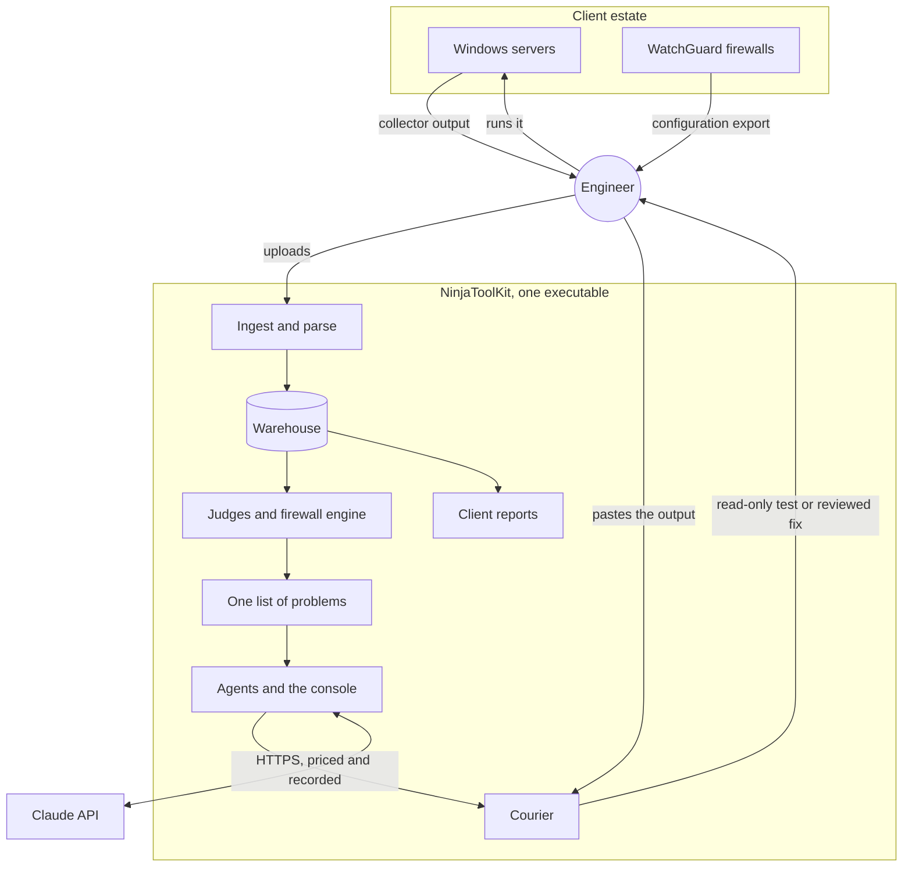
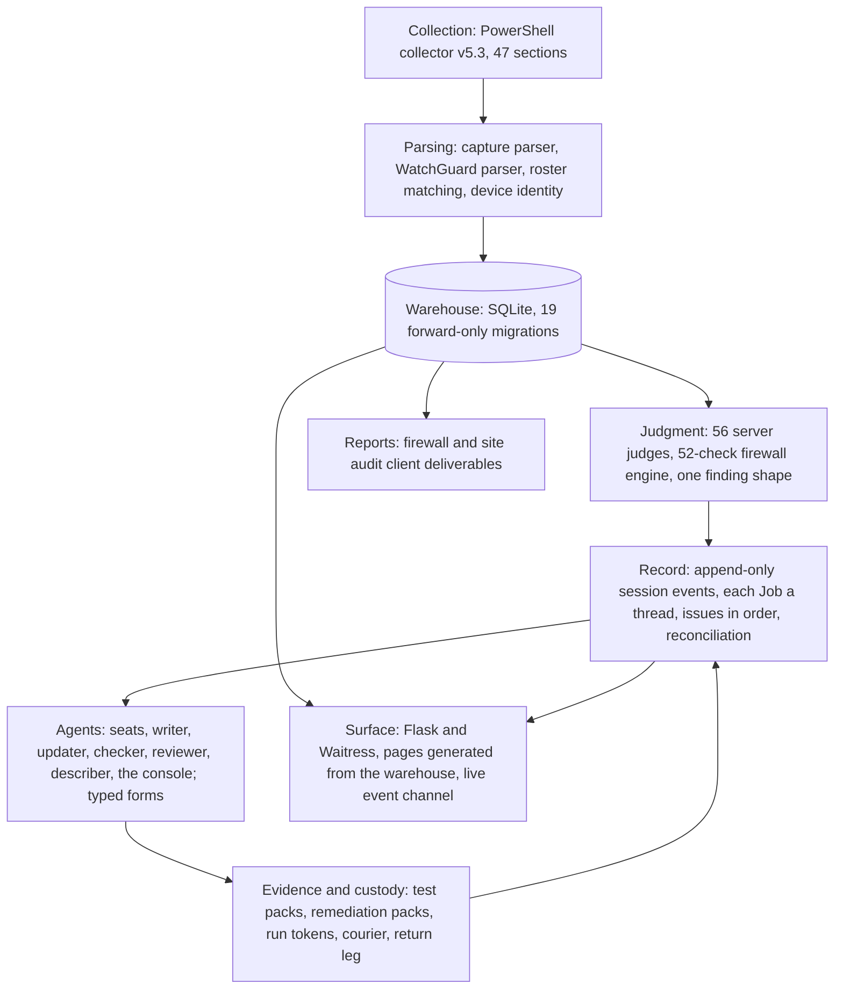
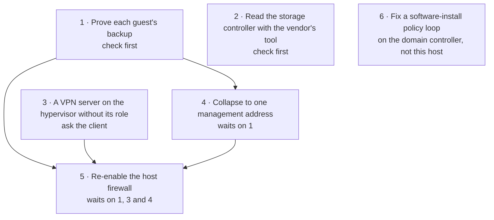
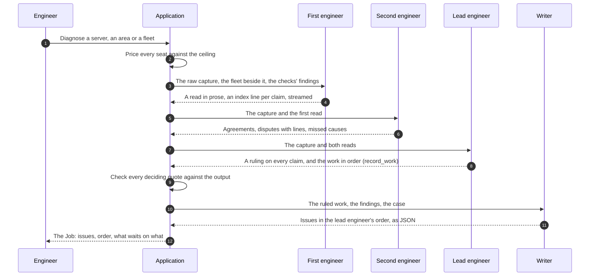
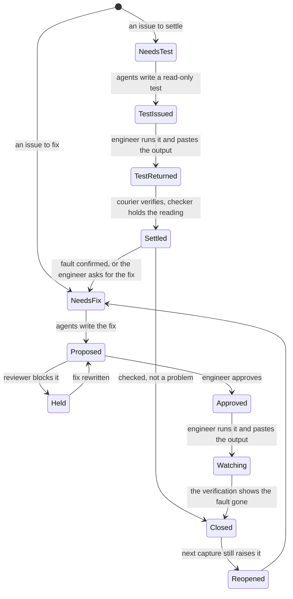
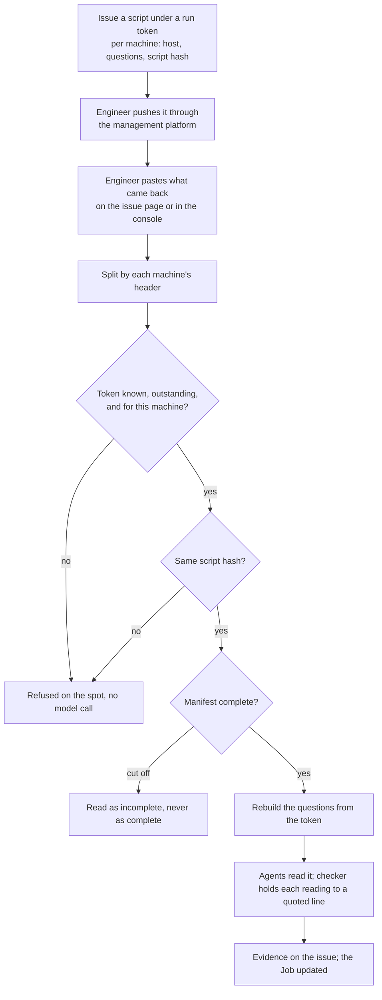
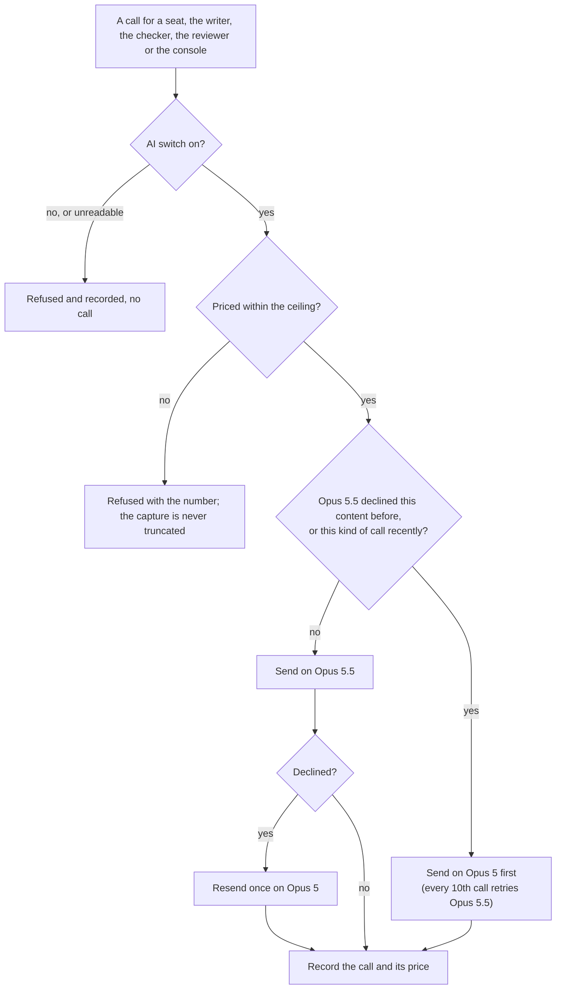
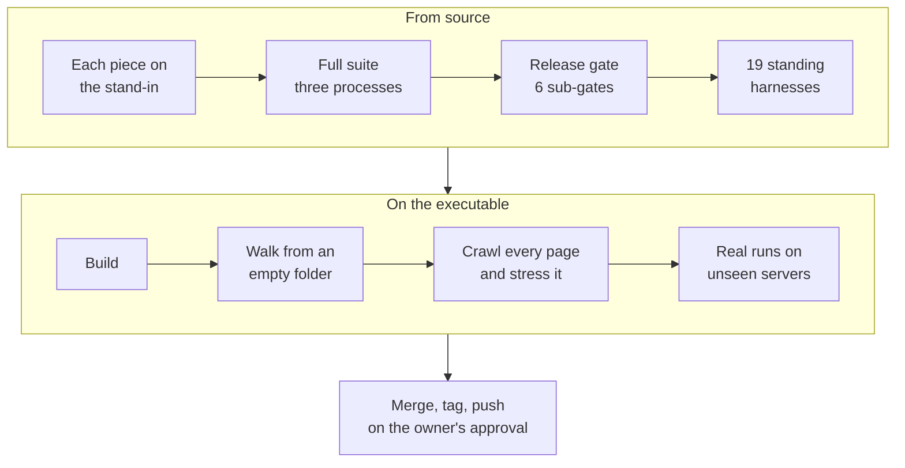

# NinjaToolKit: An Agentic Audit and Remediation Platform for Managed Infrastructure

**A technical case study**

**Author:** Ryan Haig, Forward Deployed Engineer, eMazzanti Technologies

**Subject:** NinjaToolKit, the October 2026 build (the line after the v8.2.0 release of September 30, 2026)

**Status:** In use by the engineering team of a managed service provider

**Measurement:** Every figure in this document was measured against the October 2, 2026 build unless it is labelled
with an earlier release or as historical. The platform is private company software. This document describes its
design and behavior without reproducing its source, and it contains no client names, machine names or client data:
every server it describes is identified by its role alone.

---

## Contents

1. [Summary](#1-summary)
2. [Context and role](#2-context-and-role)
3. [The problem and its constraints](#3-the-problem-and-its-constraints)
4. [How it was deployed](#4-how-it-was-deployed)
5. [System architecture](#5-system-architecture)
6. [Key decisions](#6-key-decisions)
7. [How it works, capability by capability](#7-how-it-works-capability-by-capability)
8. [Data engineering: from a PowerShell capture to one list of problems](#8-data-engineering-from-a-powershell-capture-to-one-list-of-problems)
9. [Network engineering: the firewall audit engine](#9-network-engineering-the-firewall-audit-engine)
10. [Server architecture: what the judges and the agents read](#10-server-architecture-what-the-judges-and-the-agents-read)
11. [Agentic orchestration in depth](#11-agentic-orchestration-in-depth)
12. [From diagnosis to verified fix: the issue lifecycle](#12-from-diagnosis-to-verified-fix-the-issue-lifecycle)
13. [Cybersecurity: the safety model](#13-cybersecurity-the-safety-model)
14. [Model governance: routing, refusals and cost](#14-model-governance-routing-refusals-and-cost)
15. [Evaluation: accuracy, failure modes and stress](#15-evaluation-accuracy-failure-modes-and-stress)
16. [What real data broke, and how each is now held](#16-what-real-data-broke-and-how-each-is-now-held)
17. [The engineer's surface](#17-the-engineers-surface)
18. [DevOps and release engineering](#18-devops-and-release-engineering)
19. [Results](#19-results)
20. [How I build](#20-how-i-build)
21. [Lessons](#21-lessons)
22. [What comes next](#22-what-comes-next)
23. [Appendix A: glossary](#23-appendix-a-glossary)
24. [Appendix B: how the figures were measured](#24-appendix-b-how-the-figures-were-measured)

---

## 1. Summary

NinjaToolKit turns the raw configuration of a managed estate into engineering work that closes. An engineer drops in
the output of a PowerShell collector and the estate's firewall exports. About a minute later every server and firewall
has been judged by deterministic code. On any server, the engineer can then start a Diagnose, and three AI agents
argue over the machine's whole capture until a lead engineer rules on every claim. The result is a list of issues in
the order an engineer would work them, each one carried to a verified close: a read-only test that the engineer runs
and pastes back, a fix that a reviewer agent checks and the engineer approves, and a close that the next capture
confirms or reopens. No module in the platform can execute anything on a client machine.

The October 2026 build was evaluated on real servers it had never seen, against answer keys written from each
server's own capture before each run:

| Outcome | Measured |
|---|---|
| Accuracy | On eight servers, 40 of 47 open problems found in full, 4 in part, 3 missed. None of the claims the keys ruled out was made. |
| Evidence | Every deciding quote checked against the server's own output by code; 2 of 380 quoted spans across all the real Jobs were paraphrases |
| Cost and time | A first diagnosis cost $3.56 to $5.81 a server (about $4.50 on average over nine servers) and took 16 to 25 minutes |
| Time to first value | From an empty folder, 48 clients, 189 servers and 54 firewall exports ingested and judged in about one minute |
| Reach | 56 deterministic server judges, a 52-check firewall engine mapped to 50 compliance controls, and a role checklist for seven server roles |
| Reliability | Every page the product serves (457) crawled twice with no script error; 13,409 tests passed; every agent failure mode ends in a stated, usable state |

Three design decisions define the system:

- **The model proposes; code decides; the engineer approves.** Every answer the code acts on arrives as a typed form,
  is held to evidence before it reaches a page, and touches a server only through a person.
- **Disagreement is structural.** A single model asked to check its own diagnosis agrees with itself. The platform
  gives a second agent a different success condition (break the diagnosis) and a third the job of ruling between them.
- **Everything ships as one file.** The platform is a single self-contained Windows executable, with no runtime
  dependency beyond the model API, run from an office server by the whole team.

---

## 2. Context and role

**The operator.** A managed service provider runs the servers and firewalls of dozens of client organizations it does
not own: Windows Server estates from 2012 R2 to 2025 with Active Directory, Exchange, SQL Server, Hyper-V and Remote
Desktop roles, and WatchGuard firewalls at the perimeter. The engineering team works through a remote-management
platform that can push a script to any managed machine and return what it printed.

**The estate in this document.** The newest collector capture covers 189 servers across 48 client organizations,
from a roster of 234 managed devices. The firewall pillar holds 54 WatchGuard configuration exports from 37 devices.

**My role.** I conceived, designed and built NinjaToolKit as a forward deployed engineer embedded with the team that
uses it. I own the architecture, the domain judgment, the safety model and every release. I worked from the team's
real data from the first day, walked every release in the built executable before it shipped, and scored the agents
against problems the team had already solved by hand.

**Timeline.** The first commit was on March 6, 2026. By October 2 the repository held 4,791 commits and 57 tagged
releases, the newest being v8.2.0 on September 30. This document describes the build that followed it.

---

## 3. The problem and its constraints

### 3.1 The operating reality

A managed service provider audits estates it does not own, for clients who expect evidence, at a cadence set by the
threat picture rather than the calendar. Before this platform, a major audit meant senior engineers stitching together
the partial views of several vendor tools, each of which saw one slice of the estate. By the team's own estimate that
took 60 to 80 hours per engagement, and nothing carried forward: every audit was a one-off.

The deeper problem was what came after the audit. A report lists what is wrong. It does not diagnose why, produce
the test that would settle a doubt, order the work so that one fix does not undo another, or track whether a fix
held. That work happened in engineers' heads and in ticket threads, so it was not recorded, not reproducible and not
reviewable. And the knowledge it took (that a backup is unproven, that a firewall rule must not be turned on before
the addresses behind it are settled) lived with whichever senior engineer happened to look.

### 3.2 What the platform had to be

The constraints were set by the environment, and each one shaped the architecture:

| Constraint | Why it exists | What it forced |
|---|---|---|
| One self-contained executable | It runs on an office server used by the whole team, often with no development tooling installed | No runtime dependency beyond the model API; every asset bundled; a build check that nothing outside the bundle is opened |
| The engineer is the gate | The platform acts on client infrastructure under contract | No transport to client machines at all; every script run by a person; every change approved by a person |
| Evidence first | Client deliverables and engineering decisions must survive scrutiny | Findings carry the lines that prove them; agent claims that decide anything must quote the output, and code checks the quote |
| Nothing seeded | A demo estate in production code is a liability | The application starts empty and shows only what was ingested |
| Bounded, visible cost | Model calls are paid per token, and a runaway argument is real money | Every call priced before it is sent; a ceiling per argument and per console turn; every call recorded in one ledger |
| Frontier models only | A hallucinated finding costs more than an expensive call | No small-model tier; a cheaper model may describe but never diagnose |
| Usable by a colleague on day one | The target user opens it for the first time and must know how to start | Every page names the one thing to do next and draws a line to it |

---

## 4. How it was deployed

NinjaToolKit was built the way a forward deployed engineer builds: on the customer's real data, with the people who
use it, and against the problems they already had.

- **Real data from the first day.** Development ran on the team's own roster, collector captures and firewall exports.
  The application seeds nothing; every screen reads the database the executable builds from what it is given. A
  machine or client name never appears in product code.
- **The walk is the acceptance test.** Every release is started from an empty folder and driven the way its buttons
  drive it, then run for real on servers it has never seen. Passing tests have coexisted with wrong output in this
  codebase more than once; the walk is what decides.
- **Scored against solved problems.** Accuracy is measured against answer keys built from the team's tickets and a
  hand-run engagement: what a correct diagnosis must say, what it must not say, and what had already been fixed.
- **Time to first value of about a minute.** From an empty folder: the roster in 1.1 seconds, the 189-server capture
  in 21.5 seconds, and the 54 firewall exports audited 38 seconds after that.
- **Hand-off by design.** The guide names the next step on every page, the record keeps every decision with its
  reason, and the console can write a time entry for a whole Job, so the work survives a change of engineer.

The operating loop the team runs:

1. The remote-management platform pushes the collector to the fleet; its output is dropped on Ingest.
2. The judges raise every finding; the engineer picks a server (or a client's fleet) and starts a Diagnose.
3. The issues arrive in order. For each, the agents write a read-only test; the engineer pushes it through the same
   platform and pastes back what each machine printed.
4. The agents read the result, update the Job, and write a fix when the evidence supports one. A reviewer agent checks
   it; the engineer approves it, runs it, and pastes the output back; a verification closes the issue.
5. The next capture confirms every close or reopens what did not hold.

---

## 5. System architecture

### 5.1 Context

The platform sits between the engineer and the estate, never between the estate and anything else. Data reaches it
only through the engineer (a collector run, a configuration export), and work leaves it only through the engineer (a
script to run). The one external network dependency is the model API, used only when the engineer has switched the
AI on.

### 5.2 Layers

| Layer | Representative modules | Size in the October build |
|---|---|---|
| Collection | the PowerShell collector | 4,083 lines |
| Parsing | capture parser, firewall engine and parser, client registry | 6,943, 12,967 and 4,245 lines |
| Judgment | server judges, one finding shape, the role checklist | 56 judges, 7 roles |
| Record | console session, event log, Jobs, run record, reconciliation | 13 event kinds |
| Agents | argument, issue write-up, reading check, fix review, describe, console runner, typed forms | 5 strict tools, 3 JSON schemas |
| Evidence and custody | target packs, script analysis, remediation packs, courier, return leg | 3 script states, 4 fix parts |
| Surface | the Flask application, the page server, 102 console modules | 68,591 lines in `ui/` |
| Reports | the firewall and site audit renderers | 48,286 lines |
| Model access | one API client, model registry, call ledger, master switch | 24 modules in the AI package |

The product is 209,792 lines of Python in 221 files, with 159,241 lines of tests in 606 files.

### 5.3 Runtime model

The executable starts a Flask application under the Waitress WSGI server, creates a `data` folder beside itself for
the SQLite warehouse and logs, and serves the console on a local port. Pages are generated on the server from the
warehouse and carry their own scripts and styles; there is no front-end build step and no framework.

A page build is reused until the warehouse changes. The cache is keyed on the database file itself, never on a clock,
because a clock-based cache serves stale data for its whole window and cannot say that it did. When only an agent's
write moved the file, the last page is served at once and rebuilt behind the response. State that must be live (which
machines owe a transcript, which runs are going) therefore travels on a shared poll of the running work, never inside
the cached page.

Long-running work (a Diagnose takes 16 to 25 minutes on a real server) runs on a background thread per session. The
page follows it through a server-sent event stream keyed by the session's event sequence number, so a dropped
connection resumes exactly where it stopped. A queue starts one Diagnose at a time; a Job's start is claimed in one
locked write, so a restart can never start a queued Job twice.

### 5.4 The record is the source of truth, and the Job is its thread

Everything the platform does is an event in an append-only log, one session per object (a server, a client, a
firewall). A Job is not a table. It is a thread inside that log, read back from its own events: the engineer's
request, the agents' turns and claims, the lead engineer's decision, the issues and their order, the console's
conversation, the scripts issued, what came back, and the decisions that closed each issue. The Job page and the
console are two views of that one record.

- **A restart cannot corrupt a Job.** Every projection is rebuilt from the log. A run that a dead process left open is
  found at boot, marked stopped with the moment it stopped, and offered for resumption.
- **Two Jobs on one server never share a conversation.** The history the model receives for a console turn is built
  from that Job's events alone.
- **Absence is not zero.** A script with no returned output is "not returned", never "returned empty". A capture that
  could not read a section says so, and that is kept apart from "measured and found nothing". A missing setting for
  the AI switch reads as off.

---

## 6. Key decisions

Each decision below is recorded the way an architecture decision record is: the situation, the options, the choice,
and what it made easier and harder.

### 6.1 Deterministic judgment before any model

- **Context.** An estate of hundreds of servers must be triaged before any money is spent, and the same finding must
  read the same way every time.
- **Options.** Ask a model about every server; or encode what a senior engineer checks as code and use models only
  where judgment is needed.
- **Decision.** 56 judges and a 52-check firewall engine run on every ingest, at no cost, and agents are run on the
  machines the engineer picks.
- **Consequences.** Triage is free and reproducible, and the agents start from a known list. Each judge's precision
  must be measured on the real estate, because a finding raised everywhere teaches engineers to ignore it (Section
  10.2).

### 6.2 No transport to client machines

- **Context.** The platform acts on infrastructure it does not own, under contract.
- **Options.** An agent with remote execution; or an agent that writes scripts a person runs.
- **Decision.** No module can open a session to a host. The engineer runs every script through the team's own
  management platform and pastes back what it printed.
- **Consequences.** The strongest safety guarantee is structural rather than procedural. The cost is a human round trip
  per test, which the design turns into an advantage: one read-only script can ask every open question on a client's
  machines at once (Section 7.3).

### 6.3 Adversarial roles with conflicting success conditions

- **Context.** A model asked what is wrong commits to an answer and then defends it.
- **Options.** One agent with self-critique; or separate roles whose goals conflict.
- **Decision.** A first engineer reads the server; a second reviews that read with the task of breaking it; a lead
  engineer rules on every claim and decides the work.
- **Consequences.** Retractions that took an engineer a day happen inside the run. Each Diagnose makes three long calls,
  which the shared prompt cache makes affordable (Section 11.6).

### 6.4 Every answer the code acts on is a typed form

- **Context.** Model text read by delimiters failed in practice: a collector that prints `Enabled: False | ...` split a
  pipe-delimited claim in the wrong place, and an order of work written in prose was lost.
- **Options.** Harden the text parsers further; or have the model answer through strict tools and JSON schemas.
- **Decision.** The lead engineer's decision, the reviewer's verdict, every fix and script proposal, the writer's
  issues, the updater's changes and the checker's readings arrive as strict structured outputs. The text parsers remain
  as stated fallbacks.
- **Consequences.** Order, dependencies and machines survive as data. Five strict tools in one request exceeded the
  API's grammar limit when measured, so each surface carries at most three and the tool lists are designed per
  surface.

### 6.5 One self-contained executable

- **Context.** The application runs on an office server with no development tooling and no installs.
- **Options.** A hosted service; a Python install; or one frozen executable.
- **Decision.** One PyInstaller executable of about 69 MB that creates its own database on first run.
- **Consequences.** Deployment is copying a file. Every release must be proven on the built executable, because paths
  and imports that work from source can fail when frozen.

### 6.6 An append-only record, with the Job as its thread

- **Context.** Agents, engineers and captures all change the state of the same work, sometimes at once.
- **Options.** Mutable state tables; or an event log with projections.
- **Decision.** One append-only log per object; every view is rebuilt from it.
- **Consequences.** History is complete and restarts are safe. Deleting is an event, not an erasure, and the interface
  says so.

### 6.7 A stand-in for the model API

- **Context.** Agent flows have many failure modes, and proving each on a paid model would cost real money every time.
- **Options.** Mock at the function level; or imitate the API on the wire.
- **Decision.** A local server that speaks the streaming API and returns scripted answers, tool calls, refusals,
  cut-offs, loops and errors on request.
- **Consequences.** Every agent flow is proven at no cost, in the built executable. Paid calls are reserved for proofs
  only a real model can give, each with a budget set in advance. A stand-in can hide a defect a real model exposes, so
  every build is also run for real.

### 6.8 Frontier models only, with refusals routed and never reworded

- **Context.** Security diagnosis is the kind of work frontier models sometimes decline.
- **Options.** A cheaper model tier; rewording requests; or routing.
- **Decision.** Claude Opus 5.5 first and Opus 5 as the floor; a declined call is resent once on the floor and later
  calls of that kind go there first. A request is never reworded to get past a safety classifier.
- **Consequences.** About one call in eleven was declined in the October evaluation, costing 12% of spend. The
  legitimate route to remove it is the provider's verification program for defensive security work.

---

## 7. How it works, capability by capability

Each capability below is described as an objective, the approach that meets it, and the outcome measured on the
October build.

### 7.1 Ingest and judge the estate

**Objective.** Turn a roster, a fleet-wide capture and a set of firewall exports into one list of problems, worst
first, with no model call.

**Approach.**

1. The roster goes in first; it defines which clients and machines exist.
2. The capture is split by host, stripped of the management platform's wrapper text, matched to the roster
   case-insensitively, and parsed into 47 sections.
3. Each firewall export is parsed, audited by the full engine and stored against the device it came from.
4. The judges and the firewall checks raise findings in one shared shape; findings of one type become one problem with
   one page; a problem found at two or more clients becomes a Global.

**Outcome.** From an empty folder, 48 clients, 234 devices, 189 servers and 37 firewalls were ingested and judged in
about one minute, with no machine unmatched. The 46 machines on the roster with no capture yet say whose they are and
that the collector has not run on them.

### 7.2 Diagnose one machine

**Objective.** Read a server the way a senior engineer does, with every claim tied to a line of its own output, and end
with the work rather than a report.

**Approach.**

1. The first engineer reads the whole raw capture, with the client's other machines and firewall alongside, and writes
   its read in prose with an index line per claim.
2. The second engineer reviews that read: agrees where the evidence is plain, disputes with the line where it is not,
   and adds what was missed.
3. The lead engineer rules on every claim and records the decision through a strict tool: the pieces of work in the
   order to do them, what each waits on, the machine each next piece of data comes from, the checks' findings that are
   not faults here, and the next read-only test.
4. Code checks every deciding quote against the output; a ruling whose quote is not there steps down.
5. A role checklist (domain controller, certification authority, Hyper-V host, Remote Desktop host, file server, SQL
   Server, Exchange server) asks the agents to answer each role's essentials or put the read in the next test.

**Outcome.** Eight servers scored against keys: 40 of 47 problems found in full, 4 in part, 3 missed, and none of the
claims the keys ruled out. On an Exchange server it had never seen, the run found a 2.1 TB mailbox database with no
copy and less free space on its drive than its own size, and mailbox logons failing about three times a minute. It
named the endpoint agent that was running rather than calling the server unprotected, which was the key's trap.

### 7.3 Organize the work

**Objective.** List the work in the order it must be done, so that no fix undoes another and no engineer has to rebuild
the reasoning.

**Approach.** The writer builds one issue per piece of work, in the lead engineer's order, then applies a stable sort on
what each waits on. Each issue carries its kind (a test first, a fix, a question for the client, a project), its
machine, and its prerequisites. The next step is the first open issue whose prerequisites are done. One read-only
script can ask every open question across a client's Jobs and machines at once.

**Outcome.** On a Hyper-V host whose guests include a domain controller, and whose firewall was off on every
profile, the lead engineer placed turning the firewall back on after three things: proving the guests' backups,
settling a VPN server running on the hypervisor without its role, and collapsing the host to one management
address. That is the order that keeps the guests and their management reachable when the firewall comes on. The page
shows "waits on 1, 3 and 4", the policy loop is filed on the domain controller where it can be fixed, and the guide
points at the issue to work first.

### 7.4 Test and return the evidence

**Objective.** Settle a doubt with a read-only test, and accept only output that provably came from that test on that
machine.

**Approach.** Each test is issued under a run token bound to the machine, the questions and the script's hash. A paste
from the management platform is split by its per-machine headers, each machine verified against its own token. The
agents read the output, and a checker holds every reading to a quoted line that code confirms is really there.

**Outcome.** A test written for one machine and pasted from another is refused on the spot, without a model call. A
2.2 MB paste is refused plainly with an instruction to attach the file. One script for two machines, pasted at once,
files each answer to its own Job.

### 7.5 Fix, review, approve, verify, close

**Objective.** Carry a fix to a verified close with a backup taken first, an undo that works, and a person's approval.

**Approach.** The agents write the fix through a strict tool in four parts (backup, apply, revert, verify). A reviewer
agent reads the change against the machine's own evidence and objects only on that evidence. The script ships inert:
nothing changes until the engineer sets the apply switch. After the run is pasted back, the issue is watched until a
verification shows the fault gone, and the next capture confirms or reopens it.

**Outcome.** On the Exchange server, a host-hardening fix was written and passed review for $1.01. It was gated behind
the apply switch, backed up to a folder for its Job on the server, and its revert reads that backup.

On a domain controller that is also its domain's certification authority, the fix closing four over-permissive shares
took three rounds:
- **Writing it, the agent corrected its own brief twice.** The ACL tool saves file permissions but not share
  permissions, so the backup also prints the commands that restore each share. And restricting the agent-distribution
  share to administrators would have cut off every machine that pulls from it, so that share was narrowed to read
  access instead.
- **The fix stops before any change** if exported key material sits in the certification authority's backup folder,
  because a key in a share open to everyone is an incident, not a hardening ticket.
- **The reviewer held it twice**, each time for undo commands that pointed at the wrong folder and would have restored
  nothing. It passed the third version with notes.

### 7.6 The firewall track

**Objective.** Turn a firewall's audit into work, with fixes that the engineer makes by hand in the vendor's tools and
evidence that comes from the device itself.

**Approach.** A Job is written from the 52 checks' findings. Fixes are written as numbered steps in Policy Manager and in
the web interface, with the configuration saved first, how to put it back, and what a new export will show. A log
export from the vendor's cloud is read as evidence; a new configuration export closes an issue whose finding it no
longer raises, and says "still there" when it does.

**Outcome.** On a firewall with 59 findings, the Job held 21 issues for $0.24, led by nine static NAT translations
publishing Remote Desktop to the internet. The fix by hand for its open management and SNMP policies cost $2.07. It read
the export, corrected the issue's own description where the export disagreed, and passed review with the advice to
keep a recovery session open while the change is made.

### 7.7 The console

**Objective.** Let the engineer talk to the work: ask anything about the Job, have it act within the safety model, and
take the record away.

**Approach.** The console is its own conversation whose fixed instructions are the Job's record: the capture, the
rulings, each issue with its steps, each script with what came back. It carries six tools on a server (propose a
script, propose a fix, review a fix, read another server of the client, list the fleet, amend an issue), at most four
tool rounds a turn, each priced under a $3.00 ceiling.

**Outcome.** Asked for a time entry for a whole Job, it wrote about 7,000 characters with no timestamps: the server's
roles, what was read, the corrections made to the automated findings, the ruled work and the fix's review rounds,
ready to paste. Asked about the session and how it felt about it, it answered candidly. Asked for a cupcake recipe, it
gave one and returned to the Job's next step. A question costs $0.21 to $0.42 once the server's capture is cached;
the first question on a server costs about $1.40 to $1.85, because it writes the cache.

### 7.8 The guide

**Objective.** A colleague who opens the application for the first time knows what to do next.

**Approach.** Every page names one next step and draws a line to it: "Copy the script and run it on this server", "This
fix waits on issue 1. Work that first", "Run the collector on this machine, then drop its output on Ingest". The guide
moves aside for the console and never covers it.

**Outcome.** All 457 pages the product serves were crawled in a real browser: none threw a script error or failed a
request. The crawl found the one class of page with nothing to say: the 46 roster machines with no capture read "No
such server". They now name the client and say to run the collector, and the guide points at Ingest.

---

## 8. Data engineering: from a PowerShell capture to one list of problems

### 8.1 The collector

The collector is a 4,083-line PowerShell script (version 5.3), plain ASCII so that it parses under Windows PowerShell
5.1. It is pushed across the fleet by the management platform. It captures 47 sections of configuration and state:

- hardware and firmware, the operating system and its servicing stack, and patches;
- services and their accounts, listening ports and scheduled tasks;
- local and domain accounts, group membership, and shares with their NTFS permissions;
- all four certificate stores, the host firewall, DNS, time and event logs;
- backup and volume shadow copy state, disk health, and BitLocker and TPM;
- Kerberos delegation, LAPS and LSA protection;
- SMB, TLS, RDP and WinRM posture, installed software, and more.

It is designed around one rule: **it captures what an engineer needs to reason about credential exposure, and never
the credentials themselves.** It reads password-set timestamps, service principal names, encryption types and NTLM
compatibility levels. It does not read passwords, hashes, LSA secrets or DPAPI keys.

### 8.2 Ingestion

Three inputs go in, in a fixed order, through the Ingest page. Each box takes a file that is picked or dropped:

1. **The device roster.** It defines which clients and servers exist, and nothing else can be saved until it is in.
2. **The collector's capture.** One text file may hold hundreds of servers. The parser splits it by host, strips the
   management platform's wrapper text, matches each host to the roster, and stores the parsed sections.
3. **The firewall exports.** Each WatchGuard XML export is parsed, audited by the full engine, and stored with its
   canonical audit in one transaction, against the device it came from (Section 8.5).

The parser tolerates missing sections, partial sections and version drift without dropping data, and it records what
it could not read rather than defaulting it. Host names arrive uppercase in one source and lowercase in another; every
join is case-insensitive, in the browser as well as on the server.

### 8.3 One finding shape, one list of problems

The server judges are functions over a parsed capture; the firewall engine is a set of checks over a normalized
configuration model. An adapter maps both into one finding shape (what was found, why it is true on this machine, the
evidence lines, what would make it wrong, the fix), and every consumer reads that shape.

On top of it sits **one list of problems**. The judges find what they were written to find. The agents, reading a
server's whole capture, find the rest. Both land in the same list, one page per problem. An issue has exactly one home.
An issue that an older open Job already holds is shown as "already open" rather than filed twice. A problem found at two
or more clients becomes a Global: a single brief for the team's project list rather than a ticket per client.

### 8.4 Stable identity for findings

A finding that is renumbered between two audits cannot be tracked, compared or reopened. Findings therefore carry a
content-derived identity from a registry of 91 signature recipes, one per finding type. Each recipe declares which
fields identify its finding, and the identity is the SHA-256 of the recipe and those normalized values. Recipe
identifiers are permanent, because renaming one would orphan every record that refers to it.

### 8.5 Device identity: a firewall is its configuration, not its file or its client

Through v8.1, a firewall's audits were grouped by client and model, so a firewall uploaded without a client merged
with every other firewall of its model: 37 firewalls were shown as 25. A firewall is now identified by its
configuration's own system name and model, never by its file name. The same export under another file name is a new
capture of the same device; a file name already held by a different system is stored as a second device. The client
link is suggested from the roster and stored only when the engineer confirms it.

### 8.6 When the collector's own verdict is an opinion

The collector prints some verdicts of its own, and one of them was wrong on most of the estate. It printed "TLS
1.0/1.1 disabled: PASS" whenever the protocols were not configured in the registry. On every Windows Server from
2012 to 2025, a protocol that is not configured is on by the operating system's default. The parser had trusted the
verdict, and the judge had skipped operating-system defaults, so about 136 servers in the newest capture read as
secure when they were not.

The parser now reads the per-protocol lines with the operating system's version and applies the platform default. The
judge raises "on by the OS default", and the agents are told that the collector's verdict lines are opinions. The rule
generalizes: data is read from the source lines, never from a script's summary of them.

### 8.7 Four invariants

1. **Evidence first.** A report renders the named entities behind every count.
2. **Comprehensiveness.** A firewall audit is the whole firewall. There is no "top ten".
3. **Granularity preserved.** Every captured field survives capture, parsing, the page and the report.
4. **Commercial boundary.** Client-facing reports carry no pricing, cost or margin content; a test walks the rendered
   report and fails on any currency amount outside an engineer-only container.

---

## 9. Network engineering: the firewall audit engine

### 9.1 Model and parser

The firewall pillar reads WatchGuard Fireware configuration exports into a normalized model of the device:

- policies in their true processing order, with aliases resolved to their members;
- service objects, NAT translations, and interfaces and zones;
- IKE and IPsec policies and VPN tunnels;
- accounts, authentication servers, subscription services and management settings.

XML is parsed with a hardened parser. Each upload gets its own engine instance, so two engineers auditing at once can
never overwrite each other's device.

### 9.2 The 52 checks

| Area | Checks |
|---|---|
| Rule base | overly permissive rules, shadowed rules, duplicate rules, unused and disabled rules, unattached and sparsely used objects, policy logging, configuration hygiene |
| Exposure | internet-facing services, dangerous ports, NAT exposure, deep NAT follow-through, remote access portal, geo-blocking posture |
| Cryptography and VPN | VPN security, VPN algorithms, tunnel scope, L2TP, SSL VPN, mobile VPN identity, TLS profiles |
| Management plane | management access, SNMP, logon banner, authentication posture, directory transport, credential exposure, plaintext integration credentials |
| Inspection and threat services | HTTPS inspection, proxy coverage, IPS, antivirus, advanced threat services, WebBlocker, application control, HTTP/3 and QUIC posture, DNS egress posture, DoS prevention, anti-spoofing |
| Resilience and routing | HA failover state, dynamic routing posture, IPv6 posture, wireless posture, missing security features |
| Vulnerability intelligence | firmware correlation against the known-exploited vulnerabilities catalog |
| Traffic-log analysis | traffic anomalies, denied patterns, policy hit correlation, geo-IP risks, command-and-control beaconing, lateral movement, blind spots |

When the logs a check needs are not supplied, the audit states which checks did not run and why, rather than presenting
a narrower audit as a complete one.

### 9.3 The analysis that matters

- **Precedence simulation.** Policies are evaluated in the order the device evaluates them, with aliases resolved, so a
  rule that can never match because an earlier rule takes its traffic is found as shadowed.
- **NAT follow-through.** An exposure is not the policy port. A static NAT can publish an internal RDP host on a
  non-standard external port, and a check that looks for port 3389 will see nothing. The engine follows the
  translation to the real internal host and names both.
- **Attack-chain correlation.** Findings that are individually moderate can compose into a path. The engine correlates
  them into chains and tags them with MITRE ATT&CK techniques.

The firewall is also read during a server's Diagnose. On a SQL and ERP server, the agents found Remote Desktop
published to the internet through the client's firewall NAT with Network Level Authentication off. That reading
combined the server's capture with the firewall export sitting beside it.

### 9.4 Compliance mapping

Every finding maps to the controls it affects; every control's status is derived from the findings rather than
asserted:

| Framework | Controls |
|---|---|
| PCI DSS v4.0.1 | 11 |
| CIS Controls v8.1 | 12 |
| NIST CSF 2.0 | 14 |
| CMMC 2.0 | 13 |

### 9.5 At scale

Over the 54 exports, the engine raised 2,173 findings in 8 seconds: 146 critical, 382 high, 552 medium, 609 low and
484 informational, each citing the policy by the number the device's own interface shows. Since v8.2, static NAT
translations that no enabled policy carries are low-severity clean-up items rather than critical, while NAT
follow-through still names the host behind every translation a policy does carry. A critical finding that an
engineer learns to discount teaches them to discount the rest.

---

## 10. Server architecture: what the judges and the agents read

### 10.1 The judges

The 56 judges are deterministic functions over a parsed capture. Each raises a finding only when the capture
establishes it, names what would make it wrong, and files it into one of nine areas: endpoint agents, network path,
session host, identity and name, OS and resource, hardware, third-party software, policy, and outside the host.

| Area of concern | Representative judges |
|---|---|
| Identity and Active Directory | Domain Admins sprawl, unconstrained delegation, Kerberoastable service accounts, LDAP signing not required, legacy domain functional level, stale accounts, services running as domain users |
| Exposure and protocols | legacy SMB, TLS 1.0/1.1 on by the OS default, RDP without NLA, WinRM Basic authentication, exposed database or cleartext services, host firewall off, risky custom rules, legacy name resolution, public resolvers on domain members |
| Endpoint protection | no real-time protection, two engines active at once, stale signatures, third-party remote access, Print Spooler on a domain controller |
| Resilience and recovery | no backup agent, unhealthy VSS writers, disk errors, volumes critically low, memory pressure |
| Lifecycle and servicing | end-of-life operating systems, SQL Server and software, stuck servicing stack, automatic updates disabled, certificates expiring |
| Configuration hygiene | volume encryption absent, Secure Boot disabled, legacy PowerShell engine, broad share permissions, roles installed and never used |

Eighteen judges declare a named doubt, a condition the capture cannot settle alone; those doubts are what the agents'
tests are built to settle. Thirty-nine carry a remediation, so a finding can go straight to a Job whose issues come
from code rather than a model.

### 10.2 A judge that fires everywhere has stopped being a finding

For v8.2 every judge was measured against the 200 servers of the previous capture. Six were raising findings the
capture did not establish:

| Judge | Before | After | What made the difference |
|---|---|---|---|
| Unrestricted PowerShell execution policy | 198 | 6 | The machine's own policy, not the scope the collector sets for itself |
| LDAP signing not required | 196 | 52 | Domain controllers only |
| Unconstrained delegation | 74 | 7 | Once per domain, naming only principals that are not domain controllers |
| Stuck servicing stack | 63 | 2 | A servicing flag must predate the last boot |
| Disk errors in the system log | 61 | 8 | The collector's own failed query is not a disk error |
| Unhealthy VSS writers | 14 | 4 | A failed query is recorded as not measured |

A finding raised on 198 of 200 servers teaches an engineer to skip it, and the habit carries over to the six servers
where it is true.

### 10.3 The role checklist

Judges see what they were written for; a role's essentials are often outside any one judge. The agents therefore
receive a checklist for each role the server's own record shows, and must answer each item from the output or put the
read in the next test:

| Role | What the agents must address |
|---|---|
| Domain controller | FSMO roles and replication; the PDC's time source; system-state backup age against the tombstone lifetime; krbtgt age and AES keys; DNS listing only live controllers; software with no place on a DC, by name and version |
| Certification authority | the CA database's location, size and free space; its last backup; failed and pending requests; the CRL's next update |
| Hyper-V host | each guest's backup and last recovery point; checkpoints left behind; free space for the guests; one address per subnet |
| Remote Desktop host | licensing mode, server and CALs; profile errors; an endpoint agent restarting while sessions drop |
| File server | redirected-folder ownership; VSS errors naming orphaned profiles; shares open to everyone |
| SQL Server | each database's last full and log backup and recovery model; data and log free space |
| Exchange server | each database's backup, copy and free space; every certificate it uses with its expiry; the update level and whether setup finished; queues and internet-facing connectors |

Each item was added after a real run passed over it. The certification authority's database was missed once; the
Exchange role was added after a run read a mail server well but passed over a public certificate with 133 days left.

---

## 11. Agentic orchestration in depth

### 11.1 Why one agent is not enough

A model asked "what is wrong with this server" commits to an answer and then defends it. In a real investigation the
most expensive fault is the one everybody agreed on, because several independent faults that can each produce the
symptom hide behind the first plausible cause. The platform separates the roles and gives each a different success
condition.

### 11.2 The protocol

- **The first engineer** reads all of the output and writes its read the way an engineer explains a server to a
  colleague: what the machine is, what is wrong and why, what is connected and what is not, what looks wrong but is
  not, and what is healthy. Each claim carries an index line.
- **The second engineer** was not there when the first wrote. It asks whether the read covered everything, whether a
  connection is real, and whether a fix would work on this OS. It agrees briefly where the evidence is plain, disputes
  with the line where it is not, and looks hardest in the sections the first engineer did not use.
- **The lead engineer** rules on every claim and records the decision through `record_work`: the read, each piece of
  work in order with its kind, rulings, findings covered, first step, machine, prerequisites and urgency, the checks'
  findings that are not faults here with the line that shows it, and the next read-only test.
- **The writer** turns the ruled work into issues as JSON, held to the rulings: an issue that names a machine, number
  or path the rulings do not support is dropped.

### 11.3 The claim and its statuses

Each claim's index line names an identifier, an area, a symptom, a status, the hypothesis, the quoted evidence and,
optionally, the hosts. Every status has one meaning:

| Status | Meaning |
|---|---|
| confirmed | The capture establishes that the fault is present, and the line is quoted. |
| strong | It leads, and something still has to prove it. |
| plausible | It fits, and nobody has tested it. The honest state of most of a real investigation. |
| weak | Noted, minor, and would not change what anyone does. |
| exonerated | Ruled out by a reading in this capture, which must be quoted. |

A claim is always written as the fault, never as its negation, so "confirmed" always means the fault is present. Fields
are split outside quoted text, because this collector prints pipes inside its own lines. A deciding status stands only
on a quote that code finds in the output; otherwise it steps down.

### 11.4 Typed forms and their fallbacks

Every answer the code acts on is a strict structured output:

| Form | Agent | What it carries |
|---|---|---|
| `record_work` (tool) | Lead engineer | The read, the pieces of work in order with prerequisites and machines, the findings that are not faults, the next test |
| `propose_script` (tool) | Console | A read-only test: what it settles, the machines it runs on, the questions and which way each answer cuts |
| `propose_fix` (tool) | Console | A fix: name, backup, apply, revert, verify, the machine |
| `propose_manual_fix` (tool) | Console | A firewall fix by hand: steps in Policy Manager and the web interface, the save first, the undo, the check |
| `record_review` (tool) | Reviewer | The verdict and each objection, blocking or not |
| JSON schemas | Writer, updater, checker | Issues by group; the Job's changes after a paste; each reading's verdict and quote |

All three seats are offered the same tool list, so their shared prefix stays one cached block; only the lead engineer
may call `record_work`. Every form has a text fallback that is used, and said, when a model answers without it. When
the lead engineer writes its ruling and records no decision, it is asked once more on the same cached prefix.

### 11.5 Designed for truncation, cut-offs and loops

- The tree is folded by **last assertion wins**, so a claim the lead engineer never reaches keeps the status the earlier
  seats gave it.
- Seats lead with their findings and write commentary after them, so a cut never destroys a seat's whole contribution.
- A seat that stops at its 64,000-token limit with claims cut says so on the page.
- **A seat that starts repeating itself is stopped.** In the October evaluation, three first engineers in twelve
  finished their claims, announced the record only the lead engineer may write, and then repeated a markup token to
  their limit: 71 to 73% of each reply. The stream now watches its own tail. When one piece of text repeats for 600
  characters, that call is stopped (the run is not), the reply is read up to where the repeating began, and the page
  says so instead of calling a complete list incomplete. The detector was checked on 257 real replies: it found the
  three loops and raised no false alarm. The first two seats are also told plainly that the lead engineer records the
  decision, and the next real runs ended on their own.

### 11.6 Context engineering and caching

Each seat receives the server's whole raw capture (never a digest; a digest hands the model the statistic and throws
away the evidence), the client's other machines and firewall, the team's fault library, the checks' findings with
what would make each wrong, and the role checklist. A seat that cannot be afforded in full is refused, not truncated.

The capture and the fault library are marked for a one-hour prompt cache. The second and third seats, the console, the
reviewer and the checker read what the first seat wrote at a tenth of the input price, and the reviewer and checker run
at the console's effort level so they read the console's cached output rather than writing it again. In the
evaluation, a review round cost $0.21 to $0.26 reading the console's 126,000 cached tokens; before the effort levels
were aligned it cost $0.95.

### 11.7 Agents that hold other agents to evidence

- **The writer is held to the rulings.** Unknown machines, numbers, paths and identifiers are struck.
- **The checker holds a reading to its output.** For each ruling on a pasted test, it must quote the line that shows
  it; code keeps the ruling only if the line is really in the output.
- **The reviewer checks a fix before it is offered**, objecting only on the machine's own evidence: a backup that saves
  nothing the revert can use, a revert that does not restore, a verification that cannot see the fault, a dependency
  the change would break, a script that will not run under Windows PowerShell 5.1 as SYSTEM. A blocking objection holds
  the fix; a fix is never offered unreviewed.
- **The describer**, on a cheaper model, only names the problem a ruling states, so the same problem on another server
  files with it.

### 11.8 Live orchestration

Claims are drawn as the agents write them: each completed index line is parsed from the stream and placed on its
seat's lane, and the writer's issues appear as rows while it writes. In-flight claims live only in the run's memory; a
claim counts only when its seat finishes, so a stopped seat saves nothing half-written. A finished argument can be
replayed in time.

### 11.9 Every refusal ends in a stated, usable state

| Declined on both models | What the engineer sees |
|---|---|
| First or second engineer | The run ends short, says which seat declined, keeps what was ruled, and offers Resume |
| Lead engineer | The checks' findings are filed as the issues, and the Job says plainly that nothing was ruled |
| Writer | Issues are built from the lead engineer's structured groups |
| Reviewer | The fix is held on its issue with "Ask again"; it is never offered unreviewed |
| Checker | The reading is marked unchecked, and the Job still updates |

---

## 12. From diagnosis to verified fix: the issue lifecycle

### 12.1 The lifecycle

The engineer does everything from the issue's own page: ask for a test or a fix, copy the script, paste the output
back, approve or refuse, and close with a reason. Whether the checks are enough is the engineer's decision.

### 12.2 Tests that settle one doubt

A test is built to settle one disclosed doubt; a test with no doubt to settle is a fishing trip. Every test is
read-only and declares it, carries a manifest of the sections it attempted and returned, and is addressed by host name
and doubt, never by a database row number. The agents may include their own read-only readings, which a gate checks
for anything that could change the machine; redirection to `$null` or between streams is not a write, and redirection
to any path is.

### 12.3 Chain of custody

The questions are always rebuilt from the token's own scope and never taken from the caller, so a return cannot be
read against questions other than the ones issued. The script hash proves that the script that ran is the script that
was approved. A returned test is evidence, never a remediation: a read-only test cannot mark anything as fixed.

After each paste, the writer updates the Job: its story, confirmed or reworded issues, new issues the output revealed
(on another machine when the evidence names it), and the order. Nothing is lost: closed issues stay closed, and a new
issue the Job already holds open is not written again.

### 12.4 Fixes with four parts

| Part | Behavior |
|---|---|
| Backup | Runs always, even in preview, to a folder for this Job on the server |
| Apply | Runs only when the engineer changes `$Apply = $false` to `$true`. The script ships inert. |
| Revert | The literal undo, which reads the backup, printed into the transcript and shown whole on the issue page |
| Verify | Runs before and after the change, so the transcript carries both states |

A script analyser classifies every script into one of three states: reads only; changes, with each change listed as a
plain sentence; or unreadable, when any token cannot be classified. It uses an allow list, which fails in the safe
direction.

### 12.5 The builder fails closed

In the final review before v8.2.0 shipped, a real fix walked end to end exposed that a many-line undo in a fix's header
sat live above the apply switch, so a preview run would have changed the machine. No test had caught it, because every
fix in the test corpus had a one-line undo. The repair removes the unsafe shape rather than the one instance: every
header line passes through one function that makes it a comment, the builder refuses to emit a fix with anything live
above its switch, a stored fix with that flaw is never offered again, and a verification step that would change the
machine is refused.

### 12.6 Closing and reconciling

An issue closes with one of a fixed set of reasons: fixed, the client accepts the risk, on the client's plan, not ours
to fix, the client answered, checked and not a problem, or a duplicate. A decision holds for 90 days, or until the
finding becomes worse. When a new capture arrives, every Job on that machine is reconciled: an open issue whose
findings a complete capture no longer raises closes as fixed; a fixed issue whose finding is still raised reopens; an
incomplete capture closes nothing.

---

## 13. Cybersecurity: the safety model

| Threat | Control |
|---|---|
| An agent changes a client system | There is no transport. No module can open a session to a host; a test asserts that the console runner imports nothing capable of execution. The engineer runs every script. |
| A diagnostic script mutates a server | Tests are read-only by construction and refused at build time otherwise; the agents' own readings pass the same gate. |
| A fix cannot be undone | A fix requires a backup that always runs and a literal revert. The reviewer's blocking objection holds it. |
| A fix runs without approval | Fixes ship inert and are offered for approval on the issue page. Every decision is an event in the log. |
| A fix script's header runs | Every header line is a single comment; the builder refuses anything live above the switch. |
| Pasted output is forged, altered, from another script or another machine | Run tokens per machine, script hashes and manifests; the questions rebuilt from the token, never from the caller. |
| An agent invents facts | Typed forms; deciding quotes checked against the output; the writer held to the rulings; unknown identifiers struck. |
| A loop or a cut-off corrupts a result | A repeating tail is stopped and cut; a cut list says it may be incomplete; no partial claim is saved. |
| One Job's conversation leaks into another's | The model's history for a turn is built from that Job's events alone. |
| Model output injects markup into a page | Replies are HTML-escaped before any formatting; page data is never altered by the page's own comment stripping. |
| Secrets leak | The collector captures no credentials; the API key is encrypted at rest; a scrubber redacts keys and tokens from anything headed to a page, log or response. |
| Malicious configuration files | XML is parsed with a hardened parser that refuses entity expansion. |
| The AI runs when it should not | One master switch, off by default; a missing or unreadable setting reads as off. |
| Client pricing leaks into a deliverable | The commercial boundary, enforced by a test that walks the rendered document. |
| The model is asked to produce offensive content | Every agent's instructions state that the work is defensive: describe a weakness in the terms needed to fix it, never the steps to exploit it. |

Two principles run through it. **The human gate must be informed to be real**: a list of what a script changes tells an
engineer what to check. **A guard must fail toward the safe state**: an unknown model is priced at the most expensive
rate, an unreadable setting is off, an unclassifiable script is unreadable, an incomplete capture closes nothing, and a
fix whose header would run is not built.

---

## 14. Model governance: routing, refusals and cost

### 14.1 Which model does what

| Model | Role |
|---|---|
| Claude Opus 5.5 | Every diagnostic seat, the writer and updater, the checker, the reviewer and the console |
| Claude Opus 5 | The floor: used when Opus 5.5 declines a request |
| Claude Sonnet 5.5 | Description only: a problem's name. It never diagnoses. |

There is no small-model tier. Cost is governed by ceilings and by deciding whether a call runs at all, never by lowering
the quality of the model that reasons.

### 14.2 Refusal routing

A declined call is priced at the dearer of the model asked and the model that answered. In the October evaluation, 6
of 69 real calls were declined and resent, costing $6.83 of $57.27 (12%). The platform never rewords a request to get
past a safety classifier.

### 14.3 Cost control

- **Priced before sent.** Every seat against an $8.00 ceiling for the whole argument; every console turn against its
  own $3.00 ceiling, tool rounds included.
- **One ledger.** Every model call writes one row: session, purpose, model, tokens, cache reads and writes, stop reason
  and price.
- **One source of truth for models and prices.** An unknown model is priced at the most expensive rate, because
  over-charging produces a visible early stop and under-charging a silent overrun.
- **Measured, never recalled.** A first diagnosis costs $3.56 to $5.81 a server, about $4.50 on average over nine. The
  October build's evaluation cost $59.71 in paid calls; the v8 line through v8.2.0 cost $157.02.

### 14.4 Testing without spending

Every agent flow was built and proven against a local stand-in for the model API that streams scripted answers at a
chosen pace. On request it returns tool calls, JSON answers, refusals on any seat and either model, a reply cut at its
limit, a reply that loops, a missing decision, a stream broken mid-answer, and rate-limit, overload, authentication and
credit errors. Its costs are marked as pretend.

---

## 15. Evaluation: accuracy, failure modes and stress

### 15.1 Accuracy against answer keys

**Method.** For each server, a key was written from its own capture before its run, and for three servers from the
team's hand-run engagement: what a correct diagnosis must find (each item tied to a line of the capture), what it must
not claim, and what the team had already fixed. Each run was scored item by item: found, partial or missed; any claim
the key ruled out was counted against it.

| Server (by role) | Found | Notes |
|---|---|---|
| Domain controller that is also a file server | 14 of 19, 4 partial, 1 missed | The miss (old archiver and SSH client versions) became a checklist item |
| Domain controller that is its domain's certification authority | 7 of 7 | The CA database, missed by the previous build, went into the next test |
| Terminal servers (three) | 4 of 4; 1 of 2; none open | Every item the team had fixed by hand read as fixed; the one miss was a disk start timeout passed over |
| SQL and ERP server on Server 2012 R2 | 6 of 6 | It read folder permissions the key wrongly assumed the capture lacked, and was right |
| Exchange 2019 server | 4 of 5 | Missed a certificate with 133 days left; an Exchange role was added |
| Sole domain controller with many roles, Server 2012 R2 | 4 of 4 | Also: six shares writable by everyone at both layers, one of them a folder every workstation runs software from |

**Result.** 40 of 47 open items found in full, 4 in part, 3 missed. **None** of the claims the keys ruled out was made,
including the traps: a server whose antivirus was a third-party agent rather than missing, and a lone domain
controller whose empty replication status meant no partner rather than a failure.

### 15.2 Evidence

Every deciding quote is checked against the output by code. Across all the real Jobs, 380 quoted spans read as output;
2 were paraphrases presented as quotes, a rate of about half a percent, recorded as the next thing to hold in code.

### 15.3 Failure modes

Every failure mode was produced on the stand-in in the built executable from an empty folder:

| Failure | Outcome |
|---|---|
| A seat declined on both models | Ends short, stated, resumable; ruled work kept |
| The lead engineer declined on both models | The checks' findings filed; the Job says nothing was ruled |
| The writer declined | Issues built from the structured groups |
| No decision recorded | Asked once more on the same cached prefix |
| A seat cut off at its limit | Its claims kept; the page says the list may be incomplete |
| A seat that loops | Stopped where the repeating began; its claims read; the run goes on |
| The reviewer declined | The fix held; never offered unreviewed |
| The application killed mid-run | The run reads stopped with its moment; Resume offered; the queued Job started exactly once |

### 15.4 Stress and coverage

- **Four Diagnoses pressed at once** queued, started one at a time, and each ran once.
- **Eight console questions in a row** were recorded in order, none lost or doubled.
- **A 2.2 MB paste** was refused plainly; the box takes 400,000 characters and points larger output to an attachment.
- **The capture ingested a second time** duplicated nothing: 189 servers and every Job intact.
- **Every page the product serves (457)** was fetched and every inline script parsed, then loaded in a real browser: no
  script errors, no failed requests.
- **The suite**: 13,409 tests passed in three processes, with none failing.

---

## 16. What real data broke, and how each is now held

Each defect below was found by running the built executable on real data: the walk, the crawl or a real run on a
server the platform had never seen. Each was fixed with a test and walked again.

- **A page's data was cut as if it were a comment.** At serve time the platform strips developer comments (`/* ... */`)
  from its pages, and it was also stripping the page's data. One server's web binding held `http/*:80:`, an agent's
  ruling elsewhere on the page held `**/23**`, and everything between was removed, so the page drew nothing. 49 of the
  189 servers' data carried the opening marker. Data is now its own script, which the pass leaves alone, and data
  embedded in code escapes the character.
- **Seats looped at their limit.** Section 11.5. The fix was not a larger limit, which would have let them loop longer.
- **A fix's form filled a field with script.** The fix tool's `read` field had no description, and one real answer put
  the fix's pre-flight script there; the Job's summary became PowerShell. The summary now reads only the agents' read of
  the server, both fix tools say what the field is, and a value that is plainly script is dropped.
- **A cached page carried live state.** A page served while it rebuilt still said a machine owed a transcript after its
  Job had closed. Live state now rides the shared poll.
- **A missing capture read as a missing server.** The 46 roster machines with no capture said "No such server". They
  now say whose machine it is and to run the collector.
- **A silent decline.** When the lead engineer was declined on both models, the Job read "your turn" as if the agents had
  ruled. It now says nothing was ruled.
- **A verdict that was an opinion.** Section 8.6: about 136 servers read as having legacy TLS off.
- **Passed over by every seat.** A certification authority's database growth and a mail server's certificate expiry
  were missed until the role checklist named them.

The pattern behind them is the reason the evaluation exists. None of these failed a test before it was found, and each
appeared only when real data met the built product.

---

## 17. The engineer's surface

### 17.1 Pages

| Page | What it does |
|---|---|
| Home | What is waiting on the engineer, agents at work, and the worst problems first |
| Findings | One list of problems by area, worst first, one page per problem |
| Clients, and a client's page | The client's network plan, what one change fixes on every server, its servers and firewalls; the site report |
| A server's page | Everything wrong on that machine, its capture section by section, and Diagnose |
| Firewalls, and a firewall's page | The device under the engineer's name for it, its findings and policies, its logs, its audit and report; every route from the internet inward; what changed since its last audit |
| Jobs, a Job's page, an issue's page | The board of seats, the argument drawn live, the issues in order with what each waits on, and each issue's steps to a close |
| Ingest | The roster, the captures and the exports, each with what it contributed and what it could not read |
| Settings, and the record | The AI switch and key, spend from the ledger, and the record of every act the platform took |

### 17.2 The console and the drawing

The console floats over the page it was opened on and is bound to a Job. A second question sent while the first is
being answered waits in a queue; the engineer can steer the next agent, pause or stop a run, and see within seconds a
run started from another page. The argument is drawn as it happens: one lane per seat, each claim placed at the moment
it was written, its shape and color carrying its status.

### 17.3 The design system

The console follows a written design system checked by a lint that runs with the release gates: a near-black ground
with bone-colored ink, a serif face for narrative text, a sans-serif for labels and a monospaced face for figures, and
one perceptually uniform color ramp reserved for severity, so color always means an exception. Every count opens to the
named entities behind it.

---

## 18. DevOps and release engineering

### 18.1 One file

The platform is built with PyInstaller into one executable of about 69 MB. The console's modules are bundled as data,
so a guard derives the list of hidden imports from the source, and a second check fails if anything opens a path
outside the bundle and the data folder.

### 18.2 The release pipeline

- **The suite** runs in three sequential processes so peak memory stays at a third of a single run: 13,409 passed.
- **The release gate** has six sub-gates (generated-prose voice, rendered report review, prompt-library coverage,
  compliance-gap inventory, a dependency vulnerability audit, template syntax). It stopped the v8.2.0 release on
  advisories published that morning until two libraries were upgraded.
- **The walk** starts the built executable from an empty folder and drives it the way its buttons drive it.
- **The crawl** loads every page the product serves and fails on any script error.
- **Real runs** use the real model on servers the platform has never seen, against keys written in advance.
- **Every release is tagged** and reversible; a pre-push hook refuses pushes to the release branch except at an
  approved release, by the owner.

### 18.3 Schema evolution

The warehouse is SQLite with 19 migrations, each forward-only, transactional and idempotent. The newest keeps a
firewall's logs. A failed migration rolls back to its pre-migration state.

---

## 19. Results

| Measure | Result |
|---|---|
| Accuracy (October build) | Eight servers scored against keys written in advance: 40 of 47 found in full, 4 partly, 3 missed, no ruled-out claim made |
| A first diagnosis (October build) | $3.56 to $5.81 a server, about $4.50 on average over nine; 16 to 25 minutes, median about 20 |
| Time to first value | 48 clients, 189 servers and 54 firewall exports ingested and judged in about one minute |
| The console | A question $0.21 to $0.42 with the capture cached; a reviewed fix about $1.00; a 7,000-character time entry for a whole Job |
| The firewall track | 21 issues from 59 findings for $0.24; a reviewed fix by hand for $2.07 |
| Firewall findings | 2,173 across 54 exports in 8 seconds, each with its evidence and policy number |
| Judge precision (v8.2.0) | Six judges re-measured on 200 servers: 198 to 6, 196 to 52, 74 to 7, 63 to 2, 61 to 8, 14 to 4 |
| Reliability (October build) | 457 pages crawled twice without a script error; 13,409 tests passed; every failure mode stated |
| Refusals | 6 of 69 real calls declined and resent, 12% of evaluation spend |
| Delivery | 4,791 commits and 57 tagged releases between March and October 2026; every release reversible |

The team's baseline for a major audit was 60 to 80 hours of stitching vendor output. Judging the whole estate now takes
a minute, and a machine's full diagnosis about twenty minutes and five dollars. The engineer's time goes to the part
that needs an engineer: deciding what to test, what to fix and what to tell the client.

---

## 20. How I build

I built NinjaToolKit with Claude as an engineering partner, and the way that partnership is run is as much a part of
the work as the code.

**What I own.** The architecture, the domain judgment, the safety model and the invariants, and every decision that
cannot be undone: a merge, a tag, a release, a change to a prompt, a paid call. The model writes and revises code at a
volume no single engineer could, and I hold it to a process I designed.

**The process.**

- **A plan before building.** Every phase starts as a written plan that I approve, with the user-facing effects named
  before anything is built and the audits that will judge it listed in advance.
- **A durable project record.** The position, my standing rulings and the design system live in the repository, not in
  a conversation, so decisions survive context limits and model changes.
- **Predictions before edits.** The expected measurements are written before a defect is fixed, and never adjusted
  afterwards.
- **Proof at five altitudes.** Targeted tests for each piece; a live run against the stand-in for every agent flow; a
  walk of the built executable from an empty folder; a crawl of every page; and real runs on servers the platform has
  never seen, scored against keys written before the run.
- **Human gates on irreversible actions.** Pushes to the release branch, tags and releases wait for my explicit approval
  at that moment, and the repository enforces it.
- **Measured, never recalled.** Every number in a status report, a release note or this document is the output of a
  command run at the time.

**Why it matters for the work I do.** A forward deployed engineer's job is to take frontier models into a real
operating environment and make them produce reliable work there. This platform is that problem at small scale: an
environment with real constraints, real clients and real cost, where the model's output has to be held to evidence by
code and the human has to stay in control of everything that touches production.

---

## 21. Lessons

1. **Separate the roles, and give each a success condition the others cannot satisfy.** Asking one model to be both
   author and critic produces agreement.
2. **Type every answer the code acts on.** Delimited text failed exactly where real data was messiest. Strict forms
   carry order, dependencies and machines as data; text parsing is a stated fallback, never the plan.
3. **Design for truncation, and watch for loops.** A cut reply should become a true, smaller result. A reply that
   loops is not a reason to raise a limit; measure the tail before changing the budget.
4. **Check the quote, not the claim.** A deciding status that cannot point to a real line of output does not stand.
5. **Keep the human gate informed.** A gate is only real if the person at it sees what a script changes, the reviewer's
   objections and the undo.
6. **Fail toward the safe state.** Every guard has a default, and the default is the one that stops or refuses.
7. **Absence is not zero.** Not returned is not empty; not measured is not clean; a missing capture is not a missing
   server.
8. **A script's verdict is an opinion.** Read the source lines, never a tool's summary of them.
9. **Refusals are a routing problem.** Detect, route openly, re-test the primary model, and never disguise a request.
10. **Precision is part of safety.** A finding raised on 198 of 200 servers trains the engineer to skip it.
11. **The artifact is the test.** Each defect in Section 16 passed every test until real data met the built product.

---

## 22. What comes next

- **A fix run for real, end to end.** Real fixes have been written and reviewed; running them on real servers with the
  output pasted back is the next evidence, and the team will produce it.
- **The provider's verification program.** Declines were 12% of evaluation spend and add minutes to each; the
  verification program for defensive security work is the legitimate way to remove them.
- **The collector's next version.** Uncapped event logs (the current read stops at 200 and hides counts), and reads for
  Exchange, SQL Server, the certification authority and Hyper-V that today the agents must ask for in a test.
- **Small typed models for fleet-wide reach.** Decision models such as TypeSafe's Jev and Fastino's GLiDE return a
  typed choice with a calibrated confidence, and Fastino's open GLiNER2.5 models extract entities on a CPU, each at a
  small fraction of a frontier model's price. None of them can read a whole server and write a diagnosis: a capture is
  about 46,000 tokens at the median, and only 49 of the 189 fit the largest of these models' limits. They could take
  small typed decisions across the whole fleet instead ("does this check's finding hold on this server's section",
  "did this paste settle the question"). That adds reach rather than a cheaper diagnosis, and each use needs a decision
  on sending client data to a new vendor or bundling a local model.
- **Findings the agents confirm, turned into free checks.** A problem the agents confirm on several servers becomes a
  candidate judge, so the deterministic layer grows from what the agents learn.
- **Sign-in.** Every engineer's name on every action, and a password before the application is opened beyond one
  office network.
- **A third pillar for Microsoft 365 and Entra ID tenants**, built to the same finding shape, inheriting stable
  identity, the agents and the issue lifecycle.

---

## 23. Appendix A: glossary

| Term | Meaning |
|---|---|
| Capture | The output of the PowerShell collector for one or more servers |
| Judge | A deterministic function that raises a finding from a capture |
| Finding | One thing wrong on one server or firewall, with its evidence, in the shared finding shape |
| Problem | A finding type as it appears across servers and clients; one page per problem |
| Global | A problem found at two or more clients, handled as one project |
| Job | One piece of work on one object: a thread in that object's event log |
| Seat | One agent role in the argument: first engineer, second engineer or lead engineer |
| Claim | One stated cause with a status, from a seat's index line |
| Ruling | The lead engineer's final status for a claim, with the evidence that decided it |
| Piece of work | A group of rulings that one test settles or one change closes, in the lead engineer's order |
| Issue | A unit of work on the Job: a test first, a fix, a question for the client, or a project |
| Waits on | The issues that must be done before this one, because doing it first would break or undo them |
| Role checklist | The essentials of a server role the agents must address from the output or in the next test |
| Console | The Job's conversation, with tools to propose a script or a fix, review a fix, read another server, list the fleet and amend an issue |
| Doubt | A condition a judge names but cannot settle from the capture alone |
| Run token | The identifier a script is issued under for one machine and returned under |
| Courier | The part of the platform that issues and accepts scripts under run tokens |
| Stand-in | A local imitation of the model API used to test every agent flow at no cost |
| Walk | Driving the built executable end to end from an empty folder |
| Answer key | What a correct diagnosis of a server must say and must not say, written from its capture before the run |

---

## 24. Appendix B: how the figures were measured

| Figure | Source |
|---|---|
| Code size and history | Git plumbing over the build's tree (line counts per file); the same script reproduces v8.2.0's figures exactly |
| Judges, checks, recipes, controls, firewall findings | The product's own registries and engine, imported and run over every export on the build machine |
| Ingest timing | The application's request log for an empty-folder ingest in the built executable |
| Accuracy | Keys written from each server's capture (and the team's engagement records) before each run, scored item by item |
| Cost and time | The model-call ledger, one row per call, and the session events of each run |
| Refusal rate | The same ledger's stop reasons |
| Crawl, stress, failure modes | Scripted drives of the built executable from an empty folder against the stand-in, with their logs |
| Tests | The suite run in three processes on the build's commit |
