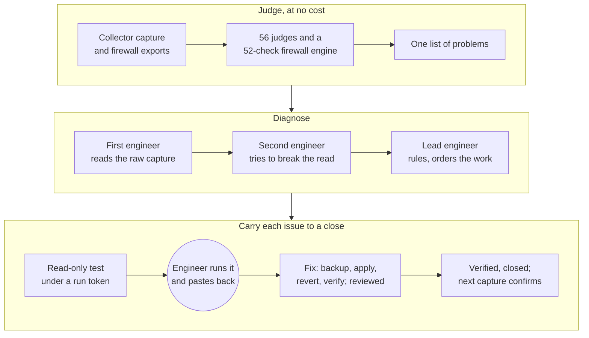

# NinjaToolKit

**An agentic audit and remediation platform for managed Windows Server estates and WatchGuard firewalls.**

Ryan Haig, Forward Deployed Engineer, eMazzanti Technologies

NinjaToolKit turns the raw configuration of a managed estate into engineering work that closes. An engineer drops in
a PowerShell collector's output and the estate's firewall exports. About a minute later every server and firewall has
been judged by deterministic code. On any server, three AI agents then argue over the machine's whole capture until a
lead engineer rules on every claim. The result is a list of issues in the order an engineer would work them, each
carried to a verified close through read-only tests, reviewed and reversible fixes, and the next capture. No module
can execute anything on a client machine: the engineer runs every script and approves every change. It ships as one
self-contained Windows executable.

Evaluated on real servers it had never seen, against answer keys written from each server's own capture before the
run, the October 2026 build found 40 of 47 open problems in full and 4 in part, and made none of the claims the keys
ruled out. A first diagnosis cost about $4.50 a server and took about 20 minutes.

**Read the full technical case study online at [ryanh-sudo.github.io/ninjatoolkit-case-study](https://ryanh-sudo.github.io/ninjatoolkit-case-study/)**,
or as [CASE_STUDY.md](CASE_STUDY.md) (about 14,000 words, with architecture, protocol and lifecycle diagrams). The
platform itself is private company software; this repository describes its design and behavior without its source or
any client data.

---

## At a glance

| | The October 2026 build |
|---|---|
| Accuracy | Eight servers scored against keys written before each run: 40 of 47 found in full, 4 in part, 3 missed, no ruled-out claim made |
| Evidence | Every deciding quote checked against the server's own output by code; 2 of 380 quoted spans across the real runs were paraphrases |
| Cost and time | A first diagnosis $3.56 to $5.81 a server, 16 to 25 minutes; a console question $0.21 to $0.42; a reviewed fix about $1 |
| Time to first value | 48 clients, 189 servers and 54 firewall exports ingested and judged from an empty folder in about a minute |
| Server judgment | 56 deterministic judges across nine areas of a server, and a role checklist for seven server roles |
| Firewall audit | 52 checks mapped to 50 controls in PCI DSS v4.0.1, CIS Controls v8.1, NIST CSF 2.0 and CMMC 2.0 |
| Agents | Three adversarial seats, a writer, an updater, a checker, a reviewer and a describer; a console on the Job with six tools; every answer the code acts on a strict structured output |
| Reliability | 457 pages crawled twice with no script error; every agent failure mode ends in a stated, usable state; 13,409 tests passed |
| Product code | 209,792 lines of Python, a 4,083-line PowerShell collector, 159,241 lines of tests |
| Delivery | 4,791 commits and 57 version tags between March and October 2026 |

---

## How it works

1. **Judge.** A 47-section PowerShell collector captures each server's configuration and state, never its credentials.
   Fifty-six judges and a 52-check firewall engine turn captures and exports into findings that share one shape and
   one list, with no model call.
2. **Diagnose adversarially.** A first engineer reads the server's whole raw capture, with the client's other machines
   and firewall beside it. A second, whose task is to break that read, disputes it with the lines and adds what was
   missed. A lead engineer rules on every claim and records the work through a strict tool: each piece in order, what
   it waits on, the machine its next data comes from, and the next read-only test.
3. **Hold the output to evidence, in code.** A deciding claim stands only on a quote that code finds in the output. An
   issue naming anything not in the rulings is dropped. A reading of a test's output stands only on a line really in
   that output. A seat that starts repeating itself is stopped and read up to where the repeating began.
4. **Organize the work.** Issues follow the lead engineer's order, then what each waits on, so no fix undoes another.
   One read-only script can ask every open question across a client's machines; a paste is split by machine and each
   answer filed to its own Job.
5. **Close the loop.** Fixes ship inert, with a backup that always runs, a literal revert, and a reviewer agent that
   holds anything whose undo would not work. A new capture closes issues whose findings are gone and reopens fixes that
   did not hold. The console converses on the whole Job and can write its time entry.

---

## What it demonstrates

**Agentic systems.** Role separation with conflicting success conditions; every answer the code acts on as a strict
tool or JSON schema, with stated text fallbacks; deciding quotes verified against the source by code; loop detection
on the stream; a one-hour prompt cache shared across seats, console, reviewer and checker; refusal-aware model routing
in which every decline ends in a stated, usable state; cost ceilings priced before every call; accuracy measured
against answer keys written before each run.

**Data engineering.** A 47-section collector and a parser tolerant of missing sections and version drift; roster
matching across sources with different identifier conventions; one finding shape over two independent engines;
content-derived finding identity from 91 signature recipes; device identity by configuration rather than by file or
client; verdicts read from the source lines, never from a script's summary; an append-only event log in which every
Job is its own thread.

**Network engineering.** A WatchGuard configuration model with policies in processing order and aliases resolved;
precedence simulation for shadowed rules; NAT follow-through to the real internal host; firewall fixes written as
steps in the vendor's own tools and closed by a new export; attack-chain correlation tagged with MITRE ATT&CK.

**Cybersecurity.** A safety model that is structural: no transport to client machines; read-only tests by
construction; a script analyser that lists every change or declares the script unreadable; a fix builder that fails
closed on any live line above its switch; run tokens, hashes and manifests on everything pasted back; model output
escaped before it is drawn; secrets never captured, encrypted at rest and scrubbed from output.

**Server architecture.** Judges across Active Directory and Kerberos, protocols, endpoint protection, backup and VSS
health, lifecycle and servicing, and host configuration, with precision measured on the estate. A role checklist makes
the agents answer the essentials of each role a server holds: domain controller, certification authority, Hyper-V,
Remote Desktop, file server, SQL Server and Exchange.

**DevOps and release engineering.** A single-file executable with bundling guards and a self-contained check; 19
forward-only migrations; a suite run in three processes; a 6-part release gate; every agent flow proven on a zero-cost
stand-in for the model API; every build walked from an empty folder, every page crawled, and the agents run for real
on servers they have never seen.

---

## How I build

I built NinjaToolKit with Claude as an engineering partner. I own the architecture, the domain judgment, the safety
model and every irreversible decision. The model writes and revises code under a process I designed:

- written plans approved before building, with the user-facing effects named in advance and the audits that will
  judge the work listed;
- a durable project record kept in the repository;
- predictions written before every defect fix;
- every agent flow proven against a zero-cost stand-in for the model API;
- every build walked in the executable, every page crawled, and real runs scored against keys written in advance;
- human approval at every merge, tag and release.

The case study's [Section 20](CASE_STUDY.md#20-how-i-build) describes it in full.

---

## The case study

| Section | Subject |
|---|---|
| [1. Summary](CASE_STUDY.md#1-summary) | What the platform does and what it measured |
| [2. Context and role](CASE_STUDY.md#2-context-and-role) | The operator, the estate and my role |
| [3. The problem and its constraints](CASE_STUDY.md#3-the-problem-and-its-constraints) | The operating reality and the constraints that shaped the design |
| [4. How it was deployed](CASE_STUDY.md#4-how-it-was-deployed) | Real data, the walk, answer keys, time to first value, the operating loop |
| [5. System architecture](CASE_STUDY.md#5-system-architecture) | Context, layers, runtime model, the Job as a thread in the event record |
| [6. Key decisions](CASE_STUDY.md#6-key-decisions) | Eight decision records: context, options, decision, consequences |
| [7. How it works](CASE_STUDY.md#7-how-it-works-capability-by-capability) | Each capability as objective, approach and measured outcome |
| [8. Data engineering](CASE_STUDY.md#8-data-engineering-from-a-powershell-capture-to-one-list-of-problems) | Collection, ingestion, one finding shape, identity, a collector verdict that was wrong |
| [9. Network engineering](CASE_STUDY.md#9-network-engineering-the-firewall-audit-engine) | The firewall model, the 52 checks, precedence and NAT analysis, compliance mapping |
| [10. Server architecture](CASE_STUDY.md#10-server-architecture-what-the-judges-and-the-agents-read) | The 56 judges, their precision on the estate, the role checklist |
| [11. Agentic orchestration](CASE_STUDY.md#11-agentic-orchestration-in-depth) | The protocol, claims, typed forms, truncation and loops, caching, verification agents, refusals |
| [12. The issue lifecycle](CASE_STUDY.md#12-from-diagnosis-to-verified-fix-the-issue-lifecycle) | Tests, chain of custody, four-part fixes, the fail-closed builder, reconciliation |
| [13. Cybersecurity](CASE_STUDY.md#13-cybersecurity-the-safety-model) | The safety model, threat by threat |
| [14. Model governance](CASE_STUDY.md#14-model-governance-routing-refusals-and-cost) | Routing, refusals, cost control, testing without spending |
| [15. Evaluation](CASE_STUDY.md#15-evaluation-accuracy-failure-modes-and-stress) | Accuracy against answer keys, evidence, failure modes, stress |
| [16. What real data broke](CASE_STUDY.md#16-what-real-data-broke-and-how-each-is-now-held) | The defects only the built product on real data showed, and how each is held |
| [17. The engineer's surface](CASE_STUDY.md#17-the-engineers-surface) | Pages, the console, the drawing, the design system |
| [18. DevOps and release engineering](CASE_STUDY.md#18-devops-and-release-engineering) | The single executable, the release pipeline, schema evolution |
| [19. Results](CASE_STUDY.md#19-results) | Measured outcomes |
| [20. How I build](CASE_STUDY.md#20-how-i-build) | The engineering method |
| [21. Lessons](CASE_STUDY.md#21-lessons) | What transfers |
| [22. What comes next](CASE_STUDY.md#22-what-comes-next) | The next line of work |
| [23. Glossary](CASE_STUDY.md#23-appendix-a-glossary) and [24. Measurement](CASE_STUDY.md#24-appendix-b-how-the-figures-were-measured) | Terms, and how each figure was measured |

---

## About the author

Ryan Haig is a Forward Deployed Engineer with a background in network engineering, Windows Server architecture and
security operations at a managed service provider. He won WatchGuard's 2026 AI Innovation Challenge, one of five
winners selected worldwide from hundreds of submissions across 19 countries, recognized at WatchGuard IMPACT North
America in Nashville in October 2026. More at [@RyanH-sudo](https://github.com/RyanH-sudo).

## Contact

- GitHub: [@RyanH-sudo](https://github.com/RyanH-sudo)
- Email: [rytuality@gmail.com](mailto:rytuality@gmail.com)
- LinkedIn: [linkedin.com/in/rytuality](https://linkedin.com/in/rytuality)

A live walkthrough of the platform is available on request.

*Every figure in this repository was measured against the October 2, 2026 build unless it is labelled with an earlier
release. No client names, machine names or client data appear in it.*
