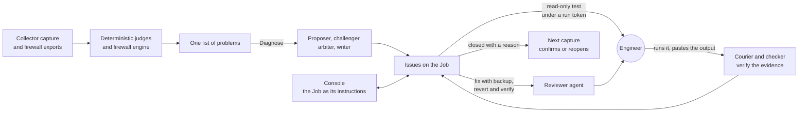

# NinjaToolKit

**An agentic audit and remediation platform for managed Windows Server estates and WatchGuard firewalls.**

Ryan Haig, Forward Deployed Engineer, eMazzanti Technologies

NinjaToolKit turns the raw configuration of a managed estate into engineering work that closes. At release (v8.2.0,
September 30, 2026), its first diagnosis of a nine-server client fleet it had never seen took 12 minutes and $4.56 in
model calls, and produced 41 issues. Carrying the work through the console to an approved fix and a closed issue
brought the run to 24 calls and $16.07. The platform has no transport to a client machine: the engineer runs every
script and approves every change. It ships as one self-contained Windows executable.

It judges every server and firewall with deterministic code, runs an adversarial multi-agent diagnosis on any server
or fleet, and walks each resulting issue to a verified close through read-only tests, reviewed and reversible fixes,
and a record that the next capture confirms or reopens. The Job is the thread: the agents' run, the engineer's
conversation with the console, every script, every returned output and every decision form one record.

**Read the full technical case study online at [ryanh-sudo.github.io/ninjatoolkit-case-study](https://ryanh-sudo.github.io/ninjatoolkit-case-study/)**,
or as [CASE_STUDY.md](CASE_STUDY.md) (about 13,500 words, with architecture and protocol diagrams). The platform
itself is private company software; this repository describes its design and behavior without its source or any
client data.

---

## At a glance

| | v8.2.0, September 30, 2026 |
|---|---|
| Product code | 203,334 lines of Python and a 4,021-line PowerShell collector |
| Tests | 13,267 passed in the release run |
| Standing verification | 19 harnesses, a 6-part release gate and 72 rendered-product invariants before every release |
| Server judgment | 55 deterministic judges across nine areas of a server |
| Firewall audit | 52 checks mapped to 50 controls in PCI DSS v4.0, CIS Controls v8, NIST CSF 2.0 and CMMC 2.0 |
| Agents | Proposer, challenger, arbiter and writer; a checker, a reviewer and a describer; a console that converses on the Job, with four tools |
| In production | 200 servers across 48 client organizations; 37 firewalls from 54 configuration exports |
| A real run at release | A nine-server fleet never seen before: 12 minutes, $4.56, 41 issues; 24 calls and $16.07 through a closed fix |
| Delivery | 4,689 commits and 57 tagged releases between March and September 2026 |

---

## How it works

1. **Judge.** A 47-section PowerShell collector captures each server's configuration and state, never its
   credentials. Fifty-five judges and a 52-check firewall engine turn captures and exports into findings that share
   one shape and one list. Each firewall is known by its configuration's own name and model, never by its file name
   or its client.
2. **Diagnose adversarially.** A proposer enumerates every candidate cause. A challenger, whose task is to break the
   proposal, downgrades what the evidence does not support and adds what was missed. An arbiter rules on every
   candidate. A writer turns the rulings into issues in the order an engineer works them. Claims are drawn on the page
   as the agents write them.
3. **Hold the output to evidence, in code.** Claims use a fixed line format that code parses. An issue naming
   anything not in the rulings is dropped. A reading of a test's output stands only on a quoted line that is really in
   the output. A fix is held if its backup or revert would not work, and it is never built if anything above its
   apply switch would run.
4. **Converse on the Job.** The console is an Opus 5.5 conversation whose fixed instructions are the Job's own record.
   It can read another server of the client, list the fleet, propose a script at the approval step or amend an open
   issue, in at most four tool rounds a turn, each priced under a $3.00 ceiling.
5. **Close the loop.** Tests are read-only and issued under run tokens with a hash chain of custody. Fixes ship inert,
   with a backup that always runs and a literal revert command. A new capture closes issues whose findings are gone and
   reopens fixes that did not hold.

---

## What it demonstrates

**Agentic systems.** Role separation with conflicting success conditions; a parse-don't-trust claim contract that
reads slipped fields by the contract's own structure and never supplies what the model did not write; protocols in
which a truncated reply degrades to a true, smaller result; context built from evidence cards the agents must cite;
checker and reviewer agents whose output code verifies; a console with a bounded, priced tool loop, cached fixed
instructions and on-demand compaction; refusal-aware model routing; cost ceilings priced before every call.

**Data engineering.** A 47-section collector and a parser tolerant of missing sections and version drift; roster
matching across sources with different identifier conventions; one finding shape over two independent engines;
content-derived finding identity from 91 signature recipes; device identity by configuration rather than by file or
client; an append-only event log in which every Job is its own thread.

**Network engineering.** A WatchGuard configuration model with policies in processing order and aliases resolved;
precedence simulation for shadowed rules; NAT follow-through to the real internal host; an exposure worklist of every
route from the internet inward; VPN and TLS cryptography review; attack-chain correlation tagged with MITRE ATT&CK;
log-driven detection of beaconing and lateral movement.

**Cybersecurity.** A safety model that is structural: no transport to client machines; read-only tests by
construction; a script analyser that lists every change or declares the script unreadable; a fix builder that fails
closed on any live line above its switch; tokens, hashes and manifests on everything pasted back; model output
escaped before it is drawn; secrets never captured, encrypted at rest and scrubbed from output; compliance mapping
derived from findings rather than asserted.

**Server architecture.** Judges across Active Directory and Kerberos (delegation, Kerberoastable accounts, LDAP
signing, functional levels), protocols (SMB, TLS, RDP, WinRM), endpoint protection, backup and VSS health, lifecycle
and servicing, and host configuration. Precision is measured on the estate: for v8.2, six judges were re-measured on
200 production servers, and the widest fell from 198 servers raised to 6.

**DevOps and release engineering.** A single-file executable with bundling guards and a self-contained check; 18
forward-only migrations; a suite run in three processes; 19 standing harnesses; a 6-part release gate that stopped
the v8.2.0 release on advisories published that morning until two libraries were upgraded; every release walked end
to end from an empty folder, then run for real on a fleet the platform had never seen; every release tagged and
reversible.

---

## How I build

I built NinjaToolKit with Claude as an engineering partner. I own the architecture, the domain judgment, the safety
model and every irreversible decision. The model writes and revises code under a process I designed:

- written plans approved before building, and a skeleton of the product's joins before any rebuild;
- a durable project record kept in the repository;
- predictions written before every defect fix;
- every agent flow proven against a zero-cost stand-in for the model API;
- every release walked in the built executable and run on data it has never seen;
- human approval at every merge, tag and release.

The case study's [Section 15](CASE_STUDY.md#15-how-i-build) describes it in full.

---

## The case study

| Section | Subject |
|---|---|
| [1. Summary](CASE_STUDY.md#1-summary) | What the platform is and what it measured at release |
| [2. The problem and its constraints](CASE_STUDY.md#2-the-problem-and-its-constraints) | The operating reality and the constraints that shaped the design |
| [3. System architecture](CASE_STUDY.md#3-system-architecture) | Context, layers, runtime model, the Job as a thread in the event record |
| [4. Data engineering](CASE_STUDY.md#4-data-engineering-from-a-powershell-capture-to-one-list-of-problems) | Collection, ingestion, one finding shape, finding and device identity, the four invariants |
| [5. Network engineering](CASE_STUDY.md#5-network-engineering-the-firewall-audit-engine) | The firewall model, the 52 checks, precedence and NAT analysis, compliance mapping, severity at scale |
| [6. Server architecture](CASE_STUDY.md#6-server-architecture-what-the-judges-read) | What the 55 judges read, and their precision measured on the estate |
| [7. Agentic orchestration](CASE_STUDY.md#7-agentic-orchestration-the-adversarial-diagnosis-and-the-console) | The adversarial protocol, the claim contract, truncation, context, verification agents, live drawing, the console |
| [8. The issue lifecycle](CASE_STUDY.md#8-from-diagnosis-to-verified-fix-the-issue-lifecycle) | Tests, chain of custody, four-part fixes, the defect a real fix exposed, reconciliation |
| [9. Cybersecurity](CASE_STUDY.md#9-cybersecurity-the-safety-model) | The safety model, threat by threat |
| [10. Model governance](CASE_STUDY.md#10-model-governance-routing-refusals-and-cost) | Routing, refusals, cost control, testing without spending |
| [11. The engineer's surface](CASE_STUDY.md#11-the-engineers-surface) | Pages, the console, the guide, the design system |
| [12. DevOps and release engineering](CASE_STUDY.md#12-devops-and-release-engineering) | The single executable, the release pipeline, schema evolution |
| [13. Verification](CASE_STUDY.md#13-verification-measurement-over-assertion) | Harnesses, the forensic campaign, what only the built executable shows |
| [14. Results](CASE_STUDY.md#14-results) | Measured outcomes |
| [15. How I build](CASE_STUDY.md#15-how-i-build) | The engineering method |
| [16. Lessons](CASE_STUDY.md#16-lessons) | What transfers |
| [17. What comes next](CASE_STUDY.md#17-what-comes-next) | The next release line |

---

## About the author

Ryan Haig is a Forward Deployed Engineer with a background in network engineering, Windows Server architecture and
security operations at a managed service provider. He won WatchGuard's 2026 AI Innovation Challenge, one of five
winners selected worldwide from hundreds of submissions across 19 countries, recognized at WatchGuard IMPACT North
America in Nashville in October 2026. More at [@RyanH-sudo](https://github.com/RyanH-sudo).

## Contact

- GitHub: [@RyanH-sudo](https://github.com/RyanH-sudo)
- Email: [rytuality@gmail.com](mailto:rytuality@gmail.com)
- LinkedIn: [linkedin.com/in/rytuality](https://linkedin.com/in/rytuality)

A live walkthrough of the platform is available on request.

*Every figure in this repository was measured against the v8.2.0 release on September 30, 2026, unless it is labelled
with an earlier release. No client names, machine names or client data appear in it.*
