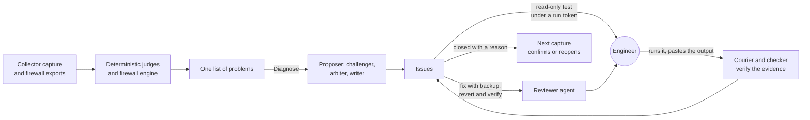

# NinjaToolKit

**An agentic audit and remediation platform for managed Windows Server estates and WatchGuard firewalls.**

Ryan Haig, Forward Deployed Engineer, eMazzanti Technologies

NinjaToolKit turns the raw configuration of a managed estate into engineering work that closes. It judges every
server and firewall with deterministic code, runs an adversarial multi-agent diagnosis on any server or fleet, and
walks each resulting issue to a verified close through read-only tests, reviewed and reversible fixes, and a record
that the next capture confirms or reopens. The engineer approves every step that touches a server. It ships as one
self-contained Windows executable.

**Read the full technical case study: [CASE_STUDY.md](CASE_STUDY.md)** (about 10,000 words, with architecture and
protocol diagrams). The platform itself is private company software; this repository describes its design and
behavior without its source or any client data.

---

## At a glance

| | v8.1.0, September 2026 |
|---|---|
| Product code | 204,142 lines of Python and a 4,021-line PowerShell collector |
| Tests | 13,875 collected, 13,822 passed, 0 failed |
| Standing verification | 19 harnesses and a 6-part release gate before every release |
| Server judgment | 55 deterministic judges across nine areas of a server |
| Firewall audit | 52 checks mapped to 50 controls in PCI DSS v4.0, CIS Controls v8, NIST CSF 2.0 and CMMC 2.0 |
| Agents | Proposer, challenger, arbiter and writer, with a checker, a reviewer and a describer |
| In production | 224 servers across 48 client organizations judged; 36 firewall configurations in the audit corpus |
| A full paid diagnosis | 4 model calls, $2.21, 21 issues, each filed under a problem with a severity |
| Delivery | 4,585 commits and 56 tagged releases between March and September 2026 |

---

## How it works

1. **Judge.** A 47-section PowerShell collector captures each server's configuration and state, never its
   credentials. Fifty-five judges and a 52-check firewall engine turn captures and exports into findings that share
   one shape and one list.
2. **Diagnose adversarially.** A proposer enumerates every candidate cause. A challenger, whose task is to break the
   proposal, downgrades what the evidence does not support and adds what was missed. An arbiter rules on every
   candidate. A writer turns the rulings into issues in the order an engineer works them. Claims are drawn on the page
   as the agents write them.
3. **Hold the output to evidence, in code.** Claims use a fixed six-field format that code parses. An issue naming
   anything not in the rulings is dropped. A reading of a test's output stands only on a quoted line that is really in
   the output. A fix is held if its backup or revert would not work.
4. **Close the loop.** Tests are read-only and issued under run tokens with a hash chain of custody. Fixes ship inert,
   with a backup that always runs and a literal revert command. A new capture closes issues whose findings are gone and
   reopens fixes that did not hold.

---

## What it demonstrates

**Agentic systems.** Role separation with conflicting success conditions; a parse-don't-trust claim contract;
protocols designed so that a truncated reply degrades to a true, smaller result; context built from evidence cards
the agents must cite; checker and reviewer agents whose output code verifies; live streaming of claims into the
interface; refusal-aware model routing; per-argument cost ceilings priced before every call.

**Data engineering.** A 47-section collector and a parser tolerant of missing sections and version drift; roster
matching across sources with different identifier conventions; one finding shape over two independent engines;
content-derived finding identity from 91 signature recipes; an append-only event log from which every Job is read.

**Network engineering.** A WatchGuard configuration model with policies in processing order and aliases resolved;
precedence simulation for shadowed rules; NAT follow-through to the real internal host; VPN and TLS cryptography
review; attack-chain correlation tagged with MITRE ATT&CK; log-driven detection of beaconing and lateral movement.

**Cybersecurity.** A safety model that is structural: no transport to client machines; read-only tests by
construction; a script analyser that lists every change or declares the script unreadable; tokens, hashes and
manifests on everything pasted back; secrets never captured, encrypted at rest and scrubbed from output; compliance
mapping derived from findings rather than asserted.

**Server architecture.** Judges across Active Directory and Kerberos (delegation, Kerberoastable accounts, LDAP
signing, functional levels), protocols (SMB, TLS, RDP, WinRM), endpoint protection, backup and VSS health, lifecycle
and servicing, and host configuration.

**DevOps and release engineering.** A single-file executable with bundling guards and a self-contained check; 17
forward-only migrations; a 13,875-test suite run in three processes; 19 standing harnesses; a 6-part release gate;
every release walked end to end from an empty folder before it ships; every release tagged and reversible.

---

## How I build

I built NinjaToolKit with Claude as an engineering partner. I own the architecture, the domain judgment, the safety
model and every irreversible decision; the model writes and revises code under a process I designed: written plans
approved before building, a durable project record in the repository, predictions written before every defect fix,
every agent flow proven against a zero-cost stand-in for the model API, every release walked in the built executable,
and human approval at every merge, tag and release. The case study's [Section 15](CASE_STUDY.md#15-how-i-build)
describes it in full.

---

## The case study

| Section | Subject |
|---|---|
| [1. Summary](CASE_STUDY.md#1-summary) | What the platform is and what it achieved |
| [2. The problem and its constraints](CASE_STUDY.md#2-the-problem-and-its-constraints) | The operating reality and the constraints that shaped the design |
| [3. System architecture](CASE_STUDY.md#3-system-architecture) | Context, layers, runtime model, the event record |
| [4. Data engineering](CASE_STUDY.md#4-data-engineering-from-a-powershell-capture-to-one-list-of-problems) | Collection, ingestion, one finding shape, stable identity, the four invariants |
| [5. Network engineering](CASE_STUDY.md#5-network-engineering-the-firewall-audit-engine) | The firewall model, the 52 checks, precedence and NAT analysis, compliance mapping |
| [6. Server architecture](CASE_STUDY.md#6-server-architecture-what-the-judges-read) | What the 55 judges read |
| [7. Agentic orchestration](CASE_STUDY.md#7-agentic-orchestration-the-adversarial-diagnosis) | The adversarial protocol, the claim contract, truncation, context, verification agents, live drawing |
| [8. The issue lifecycle](CASE_STUDY.md#8-from-diagnosis-to-verified-fix-the-issue-lifecycle) | Tests, chain of custody, four-part fixes, reconciliation |
| [9. Cybersecurity](CASE_STUDY.md#9-cybersecurity-the-safety-model) | The safety model, threat by threat |
| [10. Model governance](CASE_STUDY.md#10-model-governance-routing-refusals-and-cost) | Routing, refusals, cost control, testing without spending |
| [11. The engineer's surface](CASE_STUDY.md#11-the-engineers-surface) | Pages, the console, the guide, the design system |
| [12. DevOps and release engineering](CASE_STUDY.md#12-devops-and-release-engineering) | The single executable, the release pipeline, schema evolution |
| [13. Verification](CASE_STUDY.md#13-verification-measurement-over-assertion) | Harnesses, the forensic campaign, what only the built executable shows |
| [14. Results](CASE_STUDY.md#14-results) | Measured outcomes |
| [15. How I build](CASE_STUDY.md#15-how-i-build) | The engineering method |
| [16. Lessons](CASE_STUDY.md#16-lessons) | What transfers |
| [17. What comes next](CASE_STUDY.md#17-what-comes-next) | The next release line |

---

## About the author

Ryan Haig is a Forward Deployed Engineer with a background in network engineering, Windows Server architecture and
security operations at a managed service provider. He won WatchGuard's 2026 AI Innovation Challenge, one of five
winners selected worldwide from hundreds of submissions across 19 countries, recognized at WatchGuard IMPACT North
America in Nashville in October 2026. More at [@RyanH-sudo](https://github.com/RyanH-sudo).

## Contact

- GitHub: [@RyanH-sudo](https://github.com/RyanH-sudo)
- Email: [rytuality@gmail.com](mailto:rytuality@gmail.com)
- LinkedIn: [linkedin.com/in/rytuality](https://linkedin.com/in/rytuality)

A live walkthrough of the platform is available on request.

*Every figure in this repository was measured against the v8.1.0 release on September 28, 2026. No client names,
machine names or client data appear in it.*
